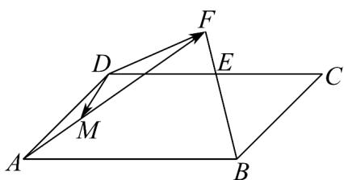
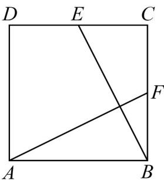

> [!faq]- 《第六章 平面向量及其应用（高效培优讲义）》官方解析
>
> > [!success]- **【答案】** $\frac{1}{4} a + \frac{1}{2} b; -\frac{17}{12}$
>
> > [!note]- **【分析】**
> > 根据平面向量基本定理以及定比分点，结合向量运算法则可得 $\overline{DF}=\frac{1}{4}a+\frac{1}{2}b$ ，用a,b表示出 $\overline{DM}, AF$ ，再由平面向量数量积运算律计算可得结果·
>
> > [!note]- **【解析】**
> > 如下图所示：
> >
> > 
> >
> > 根据题意可知 $\overline{DF} = \overline{DE} + \overline{EF} = \overline{DE} + \frac{1}{2}\overline{BE} = \overline{DE} + \frac{1}{2}\overline{BE} = \overline{DE} + \frac{1}{2}\left(\overline{BC} + \overline{CE}\right)$
> >
> > $$
> > = \frac {\square \square \square}{D E} + \frac {1}{2} \frac {\square \square \square}{B C} - \frac {1}{2} \frac {\square \square \square}{D E} = \frac {1}{2} \frac {\square \square \square}{B C} + \frac {1}{2} \frac {\square \square \square}{D E} = \frac {1}{2} \frac {\square \square \square}{A D} + \frac {1}{2} \times \frac {1}{2} \frac {\square \square \square}{A B} = \frac {1}{4} a + \frac {1}{2} b
> > $$
> >
> > 易知 $\overline{AF} = \overline{AB} + \overline{BF} = \overline{AB} + \frac{3}{2}\overline{BE} = \overline{AB} + \frac{3}{2}\left(\overline{BC} + \overline{CE}\right)$
> >
> > $$
> > = \frac {\square \square \square}{A B} + \frac {3}{2} \frac {\square \square \square}{B C} + \frac {3}{2} \times \frac {1}{2} \frac {\square \square \square}{C D} = \frac {\square \square \square}{A B} + \frac {3}{2} \frac {\square \square \square}{A D} - \frac {3}{4} \frac {\square \square \square}{A B} = \frac {1}{4} a + \frac {3}{2} b
> > $$
> >
> > 又 $\frac{DM}{DM} = \frac{DA}{DA} + \frac{AM}{AM} = \frac{DA}{DA} + \frac{1}{3} \frac{AF}{AF} = -b + \frac{1}{3}\left(\frac{1}{4}a + \frac{3}{2}b\right) = \frac{1}{12}a - \frac{1}{2}b$
> >
> > 因为 AB = 2, $AD = \sqrt{2}$ 可知 $\left|a\right| = 2, \left|b\right| = \sqrt{2}$ ;
> >
> > 所以 $\overrightarrow{DM} \cdot \overrightarrow{AF} = \left( \frac{1}{4} a + \frac{3}{2} b \right) \cdot \left( \frac{1}{12} a - \frac{1}{2} b \right) = \frac{1}{48} a^2 - \frac{1}{8} a \cdot b + \frac{3}{2} \times \frac{1}{12} a \cdot b - \frac{3}{4} b^2$
> >
> > $$
> > = \frac {1}{4 8} \left| \vec {a} \right| ^ {2} - \frac {3}{4} \left| \vec {b} \right| ^ {2} = \frac {1}{4 8} \times 4 - \frac {3}{4} \times 2 = - \frac {1 7}{1 2};
> > $$
> >
> > 故答案为： $\frac{1}{4}a+\frac{1}{2}b$ ； $-\frac{17}{12}$ ；
> >
> > 9. 正方形 $ABCD$ 的边长为 2， $E$ 为 $CD$ 的中点， $F$ 为 $BC$ 的中点，则 $AF \square BE = \_$
> >
> > 【答案】0
> >
> > 【分析】用 $AB, AD$ 表示 $AF, BE$ ，再根据向量数量积运算求解
> >
> > 【详解】在正方形ABCD中， $\left|AB\right|=\left|AD\right|=2$ ，且 $AB\perp AD$
> >
> > ∵ $AF = AB + BF = AB + \frac{1}{2} AD$ ， $BE = BC + CE = AD - \frac{1}{2} AB$
> >
> > $$
> > \therefore A F \cdot B E = \left(A B + \frac {1}{2} A D\right) \cdot \left(A D - \frac {1}{2} A B\right)
> > $$
> >
> > $$
> > = \square A B \cdot \square A D - \frac {1}{2} \square A B ^ {2} + \frac {1}{2} \square A D ^ {2} - \frac {1}{4} \square A B \cdot \square A D = \frac {1}{2} \times 4 - \frac {1}{2} \times 4 = 0
> > $$
> >
> > 故答案为：0.
> >
> > 
