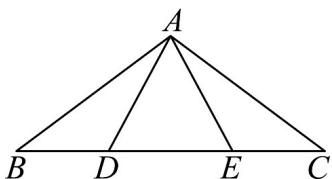

> [!faq]- 《第六章 平面向量及其应用（高效培优讲义）》官方解析
>
> > [!success]- **【答案】** $-\frac{67}{24}$
>
> > [!note]- **【分析】**
> > 先利用 $AD$ 与 $AE$ 表示 $AB$ 、 $AC$ ，再将 $AB \cdot AC$ 转化为 $AD$ 与 $AE$ 的计算，进而求解。
>
> > [!note]- **【解析】**
> > 因为 $AB = AD + DB = AD + ED = AD + EA + AD = 2AD - AE$
> >
> > 且 $\overline{AC}=\overline{AD}+\overline{DC}=\overline{AD}+2\overline{DE}=\overline{AD}+2\left(\overline{DA}+\overline{AE}\right)=-\overline{AD}+2\overline{AE}$
> >
> > 
> >
> > 则 $AB \cdot AC = \left(2AD - AE\right) \cdot \left(-AD + 2AE\right) = -2AD^{2} + 5AD \cdot AE - 2AE^{2}$
> >
> > 又因为 $\left|\stackrel{\leftrightarrow}{AD}\right|=\frac{2\sqrt{3}}{3}$ ，且 $\stackrel{\leftrightarrow}{AD}$ 与 $\stackrel{\leftrightarrow}{AE}$ 所成的夹角为 $\frac{\pi}{6}$
> >
> > 则 $\begin{array}{l}\mathbf{u}_{\mathbf{u}}\mathbf{u}_{\mathbf{u}}\\ AD\cdot AE = \left|AD\right|\cdot \left|AE\right|\cos \angle ADE = \frac{2\sqrt{3}}{3}\left|\frac{\mathbf{u}_{\mathbf{u}}}{AE}\right|\times \frac{\sqrt{3}}{2} = \left|\frac{\mathbf{u}_{\mathbf{u}}}{AE}\right| \end{array}$
> >
> > 可得 $AB \cdot AC = -2 \times \frac{4}{3} + \left| AE \right| - 2 \left| AE \right|^2 = -2 \left( \left| AE \right| - \frac{1}{4} \right)^2 - \frac{67}{24}$
> >
> > 当且仅当 $\left|\begin{matrix}A&E\end{matrix}\right|=\frac{1}{4}$ 时， $AB\cdot AC$ 的最大值为 $-\frac{67}{24}$
> >
> > 故答案为： $-\frac{67}{24}$
