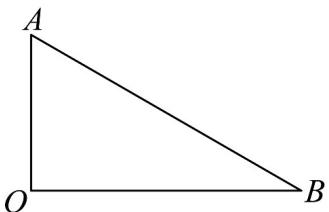

> [!faq]- 《第六章 平面向量及其应用（高效培优讲义）》官方解析
>
> > [!success]- **【答案】** ACD
>
> > [!note]- **【分析】**
> > 根据已知及向量数量积的运算律得 $|a - b| = |c| = 2$ 、 $a \cdot b = 0$ 、 $\left|\dot{a} + b\right| = 2$ 判断A、B，进而确定三个向量构成一个直角三角形，再应用向量加减的几何意义、数量积的运算律判断C、D.
>
> > [!note]- **【解析】**
> > 由题设 $|a-b|=|c|=2$ ，A对，
> >
> > 由 $|a| = 1$ ， $\left|b\right| = \sqrt{3}$ ， $(a - b)^2 = c^2\Rightarrow a^2 -2a\cdot b + b^2 = c^2\Rightarrow 4 - 2a\cdot b = 4\Rightarrow a\cdot b = 0$
> >
> > 所以 $(a + b)^2 = a^2 + 2a \cdot b + b^2 = 4$ ，则 $\left|a + b\right| = 2$ ，B 错，
> >
> > 由上知 $a \perp b$ 且 $a - b = c$ ， $\left|a\right| = 1$ ， $\left|b\right| = \sqrt{3}$ ， $\left|c\right| = 2$ ，如下图 $a = \overline{OA}, b = \overline{OB}, c = \overline{BA}$
> >
> > 显然三个向量构成一个直角三角形，且 $a, c = 60^{\circ}, b, c = 150^{\circ}$
> >
> > 
> >
> > 所以 $a + b - c = OA + OB - BA = OB + OA + AB = 2OB = 2b$ ，D 对，
> >
> > 由 $\left|a + b + c\right|^2 = a^2 +b^2 +c^2 +2a\cdot b + 2a\cdot c + 2b\cdot c = 1 + 3 + 4 + 0 + 2 - 6 = 4$
> >
> > 所以 $\left|a+b+c\right|=2$ ， $C_{对}$
> >
> > 故选 **ACD**
