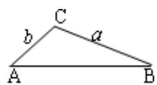

> [!faq]- 《第六章 平面向量及其应用（高效培优讲义）》官方解析
>
> > [!success]- **【答案】** ABD
>
> > [!note]- **【分析】**
> > 根据不同条件下三角形的解的个数分析判断即得·
>
> > [!note]- **【解析】**
> > 在 $\forall ABC$ 中，当已知边 $a, c$ 和锐角 $A$ ，判断三角形的个数时，若 $a < c$ ，有且只有一个解；当 $c \sin A < a < c$ 时，有两个解；当 $a = c \sin A$ 时，有且只有一个解；当 $a < c \sin A$ 时，无解。因为 $c \sin A = c \sin \frac{\pi}{4} = \frac{\sqrt{2}}{2} c$ .
> >
> > 由 $a = c\sin A$ ，即 $2\sqrt{2} = \frac{\sqrt{2}}{2} c$ ，解得 $c = 4$ ，故D正确；
> >
> > 由 $a \quad c$ ，可得 $c \leq 2\sqrt{2}$ ，选项中 $c = 1$ ， $c = 2\sqrt{2}$ 满足此条件，故 ${}^{\mathrm{A}}$ ， ${}^{\mathrm{B}}$ 正确；
> >
> > 对于 C， $c \sin A = 3\sqrt{2} \times \frac{\sqrt{2}}{2} = 3 > 2\sqrt{2}$ ，此时三角形无解，故 C 错误.
> >
> > 故选：ABD
> >
> > ## 方法技巧
> >
> > 已知两边和一边的对角或已知两角及一边时，通常选择正弦定理来解三角形；已知两边及夹角或已知三边时，
> >
> > 通常选择余弦定理来解三角形．特别是求角时尽量用余弦定理来求，尽量避免分类讨论．
> >
> > 在 $\Delta ABC$ 中，已知 $a, b$ 和A时，解的情况主要有以下几类：
> >
> > $\left\{\begin{aligned}a&<b\sin A\\ a&=b\sin A\end{aligned}\right.$ 无解 $b\sin A<a<b$ 一解(一锐，一钝)
> > - **①**：若 A 为锐角时：
> >
> > 
> >
> > $a = b\sin A$
> >
> > 
> >
> > a b
> >
> > 一解一解
> >
> > 
> >
> > 
> >
> > $b\sin A < a < b$
> >
> > $a < b \sin A$
> >
> > 两解无解
> > - **②**：若 A 为直角或钝角时： $\left\{\begin{aligned}a&\leq b\\ a&>b\end{aligned}\right.$ 无解
> > 一解(锐角)
