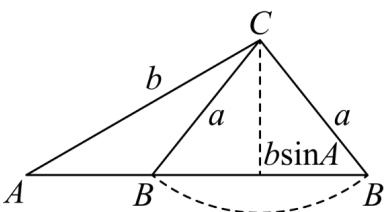

> [!faq]- 《第六章 平面向量及其应用（高效培优讲义）》官方解析
>
> > [!success]- **【答案】** $(2,4)$
>
> > [!note]- **【分析】**
> > 法一：利用正弦定理得到 $\sin B = \frac{2}{a}$ ，再根据 $B$ 有两个解，即可得到 $\frac{\pi}{6} < B < \frac{5\pi}{6}$ 且 $B \neq \frac{\pi}{2}$ ，从而得到 $\frac{1}{2} < \sin B < 1$ ，即可求出 $a$ 的取值范围；法二：作出图形，结合图形可得出角 $B$ 有两个解时， $a$ 满足的不等式，
> >
> > 进而可求得 $a$ 的取值范围·
>
> > [!note]- **【解析】**
> > 法一：由正弦定理 $\frac{a}{\sin A} = \frac{b}{\sin B}$ ，则 $\sin B = \frac{b\sin A}{a} = \frac{2}{a}$ ，因为角 $B$ 有两个解，又 $A = \frac{\pi}{6}$ ，所以 $\frac{\pi}{6} < B < \frac{5\pi}{6}$ 且 $B \neq \frac{\pi}{2}$ ，所以 $\frac{1}{2} < \sin B < 1$ ，即 $\frac{1}{2} < \frac{2}{a} < 1$ ，解得 $2 < a < 4$ ，即 $a\hat{l}(2,4)$ .
> >
> > 法二：在 $\vee ABC$ 中， $b = 4$ ， $A = \frac{\pi}{6}$ ，如下图所示：
> >
> > 
> >
> > 若使得角 B 有两个解，则 $b \sin A < a < b$ ，即 2 < a < 4。
> >
> > 故答案为： $(2,4)$ .
