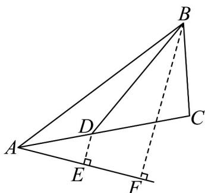

> [!faq]- 《第六章 平面向量及其应用（高效培优讲义）》官方解析
>
> > [!success]- **【答案】** C
>
> > [!note]- **【分析】**
> > 先由题设结合余弦定理求出 $A=\frac{\pi}{6}$ ，接着将所求进行转化得到 $AD+2BD=2(BD+AD\sin\frac{\pi}{6})$ ，再构造
> >
> > $\angle EAC = \frac{\pi}{6}$ ，过 $D$ 作 $DE\perp AE$ ，垂足为 $E$ ，过 $B$ 作 $BF\perp AE$ ，垂足为 $F$ ，数形结合即可分析求解
>
> > [!note]- **【解析】**
> > 因为 $AB = 4, BC^2 - AC^2 = 16 - 4\sqrt{3}AC$ ，所以 $BC^2 - AC^2 = AB^2 - \sqrt{3}AB \cdot AC$
> >
> > 则 $\sqrt{3} AB\cdot AC = AB^2 +AC^2 -BC^2$
> >
> > 由余弦定理， $\cos A = \frac{AB^2 + AC^2 - BC^2}{2AB \cdot AC} = \frac{\sqrt{3}}{2}$
> >
> > 又 $A \in (0, \pi)$ ，所以 $A = \frac{\pi}{6}$
> >
> > 则 $AD + 2BD = 2\left(BD + \frac{1}{2} AD\right) = 2(BD + AD\sin \frac{\pi}{6})$
> >
> > 如图，设 $\angle EAC = \frac{\pi}{6}$ ，过 $D$ 作 $DE\perp AE$ ，垂足为 $E$ ，则 $AD\sin \frac{\pi}{6} = DE$
> >
> > 过 B 作 $BF \perp AE$ ，垂足为 F
> >
> > 则 $AD + 2BD = 2(BD + DE)$ $2BF = 2AB\sin\left(\frac{\pi}{6} + \frac{\pi}{6}\right) = 2 \times 4 \times \frac{\sqrt{3}}{2} = 4\sqrt{3}$
> >
> > 
> >
> > 故选 **C**
