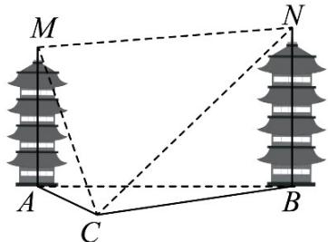

<!-- question-source:start -->
【变式3】某数学建模活动小组在开展主题为“空中不可到达两点的测距问题”的探究活动中，抽象并构建了

如图所示的几何模型，该模型中 $MA$ ，NB均与水平面ABC垂直，在已测得可直接到达的两点间距离 $AC$ ，

BC，且 AC < BC，用测角仪测得 $\angle MCA$ ， $\angle NCB$ 的情况下，四名同学用测角仪各自测得下面一个角：①

$\angle ABC$ ; ② $\angle ACB$ ; ③ $\angle BAC$ ; ④ $\angle MCN$ , 其中一定能唯一确定 M, N 之间的距离有 \_\_\_\_ · (写出所有

正确的序号）

<!-- question-source:end -->

![[高中/课堂同步/题库/人教A版高中数学同步讲义(2026)/02_必修第二册/第六章 平面向量及其应用/第六章 平面向量及其应用（高效培优讲义）/题型14_解三角形的实际应用/questions/answers/Q00078626A1.md]]
