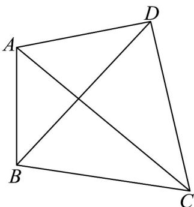
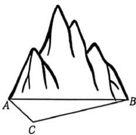

> [!faq]- 《第六章 平面向量及其应用（高效培优讲义）》官方解析
>
> > [!success]- **【答案】** (1) $\frac{2\sqrt{6}}{7}$ (2) $10\sqrt{15}$ 米
>
> > [!note]- **【分析】**
> > （1）先利用三角函数的二倍角公式求出 $\cos\angle ABC$ ，然后求出 $\sin\angle ABC$ ，进而根据正弦定理求出结
> >
> > 果即可·
> >
> > (2) 先根据余弦定理求出 $BC = 40$ ，然后根据余弦定理求出 $DB = 10\sqrt{10}$ ，最后根据余弦定理求出结果
>
> > [!note]- **【解析】**
> > （1）因为 $\angle DBA = \angle DBC, \cos \angle DBA = \frac{\sqrt{10}}{5}$ ，所以
> >
> > $$
> > \cos \angle A B C = \cos 2 \angle D B A = 2 \cos^ {2} \angle D B A - 1 = 2 \times \frac {2}{5} - 1 = - \frac {1}{5}.
> > $$
> >
> > 所以 $\frac{\pi}{2}<\angle DBA<\pi$ ，所以 $\sin\angle ABC=\sqrt{1-\cos^{2}\angle ABC}=\sqrt{\frac{24}{25}}=\frac{2\sqrt{6}}{5}$
> >
> > 在 $\triangle ABC$ 中，根据正弦定理， $\frac{AB}{\sin\angle ACB} = \frac{AC}{\sin\angle ABC}$ ，即 $\frac{50}{\sin\angle ACB} = \frac{70}{2\sqrt{6}}$ ，
> >
> > 解得 $\sin\angle ACB=\frac{50\times\frac{2\sqrt{6}}{5}}{70}=\frac{2\sqrt{6}}{7}$
> >
> > (2) 在 $\triangle ABC$ 中，根据余弦定理， $AC^2 = AB^2 + BC^2 - 2AB \cdot BC \cdot \cos \angle ABC$
> >
> > 化简得 $BC^{2} + 20BC - 2400 = 0$ ，由于 BC > 0，所以解得 BC = 40 米。
> >
> > 因为 $DB = DC$ ，在 $\triangle DBC$ 中，根据余弦定理 $DC^2 = DB^2 + BC^2 - 2DB\cdot BC\cdot \cos \angle DBC$
> >
> > 化简得 $1600 - 16\sqrt{10} DB = 0$ ，解得 $DB = 10\sqrt{10}$ 米·
> >
> > 在 $\triangle ABD$ 中，根据余弦定理 $AD^{2} = AB^{2} + BD^{2} - 2AB\cdot BD\cdot \cos \angle DBA$
> >
> > 化简得 $AD^{2}=2500+1000-2\times50\times10\sqrt{10}\times\frac{\sqrt{10}}{5}=3500-2000=1500$ ，解得 $AD=10\sqrt{15}$ 米·
> >
> > 
> >
> > ## 方法技巧
> >
> > 解三角形在实际中应用非常广泛，如测量、航海、几何、物理等方面都要用到解三角形的知识，解题时应认
> >
> > 真分析题意，并做到算法简练，算式工整，计算正确．其解题的一般步骤是：
> >
> > （1）准确理解题意，尤其要理解应用题中的有关名词和术语；明确已知和所求，理清量与量之间的关系；
> >
> > （2）根据题意画出示意图，并将已知条件在图形中标出，将实际问题抽象成解三角形模型；
> >
> > （3）分析与所研究的问题有关的一个或几个三角形，正确运用正弦定理和余弦定理，有顺序的求解；
> >
> > (4) 将三角形的解还原为实际问题，注意实际问题中的单位及近似计算要求，回答实际问题。
> >
> > 
