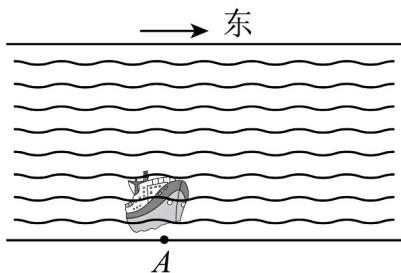

<!-- question-source:start -->
【变式1】如图所示，为了调运物资，一艘船从江的南岸 $A$ 点出发，以 $5\sqrt{3} km / h$ 的速度向垂直于对岸的方向

行驶，同时江水的速度为向东 $5km / h$

(1)试用向量表示江水的速度、船速以及船实际航行的速度；

(2)求船实际航行速度的大小与方向（用与江水的速度方向的夹角表示）.
<!-- question-source:end -->

![[高中/课堂同步/题库/人教A版高中数学同步讲义(2026)/02_必修第二册/第六章 平面向量及其应用/讲义/专题6_1_平面向量的概念_高效培优讲义_/题型04_向量知识在实际问题中的简单应用_sec_13/questions/answers/Q00065550A1.md]]
