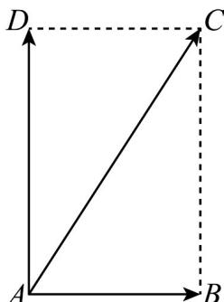

> [!faq]- 《专题6_1_平面向量的概念_高效培优讲义_》官方解析
>
> > [!success]- **【答案】** (1) AD 表示船速，AB 表示江水的速度，AC 表示船实际航行的速度；(2) 船实际航行的速度的大小 为 $10km / h$ ，方向与江水的速度方向的夹角为 $60^{\circ}$
>
> > [!note]- **【解析】**
> > 解:(1)如图所示， $\overline{AD}$ 表示船速， $\overline{AB}$ 表示江水的速度．易知 $AD \perp AB$ ，以 AD，AB 为邻边作矩形 ABCD，则 $\overline{AC}$ 表示船实际航行的速度．
> >
> > 
> >
> > (2)在 $Rt\triangle ABC$ 中， $|AB|=5, |BC|=|AD|=5\sqrt{3}$ ，所以 $|AC|=\sqrt{|AB|^2+|BC|^2}=\sqrt{5^2+(5\sqrt{3})^2}=\sqrt{100}=10$ ，因为
> >
> > $\tan \angle CAB = \frac{|\overline{BG}|}{|AB|} = \sqrt{3}$ 所以 $\angle CAB = 60^{\circ}$ ，因此，船实际航行的速度的大小为 $10km / h$ ，方向与江水的速度
> >
> > 方向的夹角为 $60^{\circ}$
