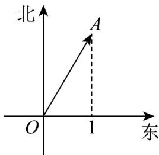

## 题型04 向量知识在实际问题中的简单应用

【典例1】如图，某船从点 $O$ 出发沿北偏东 $30^{\circ}$ 的方向行驶至点 $A$ 处，求该船航行向量 $\overline{OA}$ 的长度（单位：n

mile).

【答案】2 n mile.

【详解】由题意 $\left|\begin{matrix}OA\end{matrix}\right|=\frac{1}{\cos(90^{\circ}-30^{\circ})}=2$

所以向量 $\overline{OA}$ 的长度为 2 n mile.

## 方法技巧

准确画出向量的方法是先确定向量的起点，再确定向量的方向.

![[高中/课堂同步/题库/人教A版高中数学同步讲义(2026)/02_必修第二册/第六章 平面向量及其应用/讲义/专题6_1_平面向量的概念_高效培优讲义_/题型04_向量知识在实际问题中的简单应用_sec_13/questions/Q00065550.md]]
![[高中/课堂同步/题库/人教A版高中数学同步讲义(2026)/02_必修第二册/第六章 平面向量及其应用/讲义/专题6_1_平面向量的概念_高效培优讲义_/题型04_向量知识在实际问题中的简单应用_sec_13/questions/Q00065551.md]]
![[高中/课堂同步/题库/人教A版高中数学同步讲义(2026)/02_必修第二册/第六章 平面向量及其应用/讲义/专题6_1_平面向量的概念_高效培优讲义_/题型04_向量知识在实际问题中的简单应用_sec_13/questions/Q00065552.md]]
