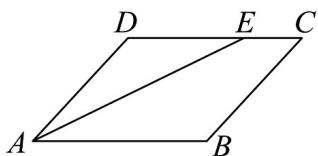

> [!faq]- 《专题6_2_平面向量的运算_高效培优讲义_》官方解析
>
> > [!success]- **【答案】** 
>
> > [!note]- **【解析】**
> > 因为 $E$ 为 $CD$ 上靠近于 $C$ 的三等分点，所以 $\frac{DE}{3} = \frac{2DC}{3} = \frac{2AB}{3}$
> >
> > 所以 $AE = AD + DE = AD + \frac{2}{3} AB$
> >
> > 又 $AB = AD = 2, \angle DAB = 60^{\circ}$ ，所以 $AB \cdot AD = 2 \times 2 \times \cos 60^{\circ} = 2$
> >
> > 所以 $AD \cdot AE = AD \cdot \left( AD + \frac{2}{3} AB \right) = AD^{2} + \frac{2}{3} AD \cdot AB = 2^{2} + \frac{2}{3} \times 2 = \frac{16}{3}$
> >
> > 故答案为： $\frac{16}{3}$
