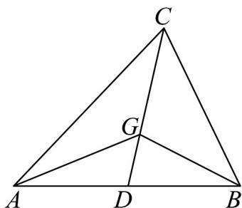
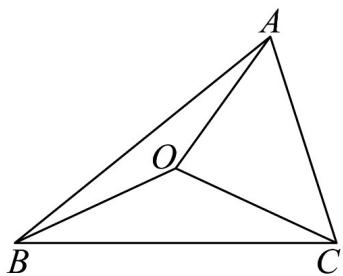
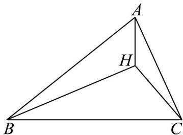

> [!faq]- 《专题6_2_平面向量的运算_高效培优讲义_》官方解析
>
> > [!success]- **【答案】** B
>
> > [!note]- **【解析】**
> > 因为 $GA + GB + GC = 0$ ，所以 $GA + GB = -GC$
> >
> > 设 $AB$ 中点为 $D$ ，则 $\overline{GA} +\overline{GB} = 2\overline{GD}$ ，所以 $-\overline{GC} = 2\overline{GD}$
> >
> > 
> >
> > 所以 $C, G, D$ 三点共线，即 $G$ 为 $\forall ABC$ 的中线 $CD$ 上的点，且 $\left|GC\right| = 2\left|GD\right|$
> >
> > 所以 G 为 VABC 的重心；
> >
> > 因为 $\left|\overline{OA}\right|=\left|\overline{OB}\right|=\left|\overline{OC}\right|$ ，所以 $\left|OA\right|=\left|OB\right|=\left|OC\right|$ ，所以 O 是 $\forall ABC$ 的外心；
> >
> > 
> >
> > 因为 $\stackrel{\square\square}{HA}\cdot\stackrel{\square\square}{HB}=\stackrel{\square\square}{HB}\cdot\stackrel{\square\square}{HC}=\stackrel{\square\square}{HC}\cdot\stackrel{\square\square}{HA}$ ，所以 $\stackrel{\square\square}{HB}\cdot\left(\stackrel{\square\square}{HA}-\stackrel{\square\square}{HC}\right)=0$ ，即 $\stackrel{\square\square}{HB}\cdot\stackrel{\square\square}{CA}=0$
> >
> > 所以 $HB \perp AC$ ，同理可得 $HA \perp BC$ ， $HC \perp AB$ ，所以 H 是 $\forall ABC$ 的垂心.
> >
> > 
> >
> > 故选 **B**
