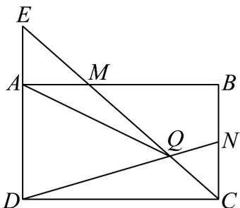
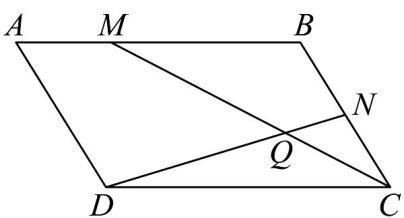

> [!faq]- 《专题6_2_平面向量的运算_高效培优讲义_》官方解析
>
> > [!success]- **【答案】** 详见解析
>
> > [!note]- **【解析】**
> > （1）由 $DN = DC + CN = AB - \frac{1}{2} AD = a - \frac{1}{2} b$ ， $CM = CB + BM = -\frac{2}{3} AB - AD = -\frac{2}{3} a - b$ ， $AQ = AM + MQ$ ，若 $E$ 是 $DA, CM$ 的交点，则 $\triangle MAE \sim \triangle MBC$
> >
> > 所以 $\frac{AE}{BC} = \frac{EM}{CM} = \frac{AM}{BM} = \frac{1}{2}$ ，则 $BC = AD = 2AE$ ， $CM = CQ + QM = 2EM$
> >
> > 由 $\triangle NQC\sim \triangle DQE$ ，则 $\frac{CQ}{EQ} = \frac{CN}{ED} = \frac{1}{3}$ ，即 $EQ = EM + QM = 3CQ$
> >
> > 所以 $CQ + QM = 2(3CQ - QM)$ ，则 $3QM = 5CQ$ ，故 $\overline{MQ} = \frac{5}{8} \overline{MC} = \frac{5}{8} \left( \overline{MB} + \overline{BC} \right) = \frac{5}{8} \left( \frac{2}{3} \overline{AB} + \overline{AD} \right)$
> >
> > 综上， $\overrightarrow{AQ} = \frac{1}{3}\overrightarrow{AB} + \frac{5}{8}\left(\frac{2}{3}\overrightarrow{AB} + \overrightarrow{AD}\right) = \frac{3}{4}\overrightarrow{AB} + \frac{5}{8}\overrightarrow{AD} = \frac{3}{4}\overrightarrow{a} + \frac{5}{8}\overrightarrow{b}$
> >
> > 所以 $\left|\overrightarrow{DN}\right|=\sqrt{\left(a-\frac{1}{2}b\right)^{2}}=\sqrt{a^{2}-a\cdot b+\frac{1}{4}b^{2}}=\sqrt{10}$
> >
> > $$
> > \left| \overrightarrow {C M} \right| = \sqrt {\left(- \frac {2}{3} a - b\right) ^ {2}} = \sqrt {\frac {4}{9} a ^ {2} + \frac {4}{3} a \cdot b + b ^ {2}} = 2 \sqrt {2}
> > $$
> >
> > $$
> > \left| \overrightarrow {A Q} \right| = \sqrt {\left(\frac {3}{4} a + \frac {5}{8} b\right) ^ {\rightarrow 2}} = \sqrt {\frac {9}{1 6} a ^ {2} + \frac {1 5}{1 6} a \cdot b + \frac {2 5}{6 4} b ^ {2}} = \frac {\sqrt {1 0 6}}{4};
> > $$
> >
> > 
> >
> > (2) 由 $\overline{MC} = \overline{MB} + \overline{BC} = \frac{2}{3} \overline{AB} + \overline{AD}$ , $\overline{DN} = \overline{DC} + \overline{CN} = \overline{AB} - \frac{1}{2} \overline{AD}$
> >
> > $$
> > \frac {\square \square \square}{M C} \cdot \frac {\square \square \square}{D N} = \left(\frac {2}{3} \frac {\square \square \square}{A B} + \frac {\square \square \square}{A D}\right) \cdot \left(\frac {\square \square \square}{A B} - \frac {1}{2} \frac {\square \square \square}{A D}\right) = \frac {2}{3} \frac {\square \square \square}{A B} ^ {2} + \frac {2}{3} \frac {\square \square \square}{A B} \cdot \frac {\square \square \square}{A D} - \frac {1}{2} \frac {\square \square \square^ {2}}{A D} = 6
> > $$
> >
> > $$
> > \left| \overrightarrow {M C} \right| = \sqrt {\left(\frac {2}{3} \overrightarrow {A B} + \overrightarrow {A D}\right) ^ {2}} = \sqrt {\frac {4}{9} \overrightarrow {A B} ^ {2} + \frac {4}{3} \overrightarrow {A B} \cdot \overrightarrow {A D} + \overrightarrow {A D} ^ {2}} = 2 \sqrt {3}
> > $$
> >
> > $$
> > \left| \overrightarrow {D N} \right| = \sqrt {\left(\overrightarrow {A B} - \frac {1}{2} \overrightarrow {A D}\right) ^ {2}} = \sqrt {\overrightarrow {A B} ^ {2} - \overrightarrow {A B} \cdot \overrightarrow {A D} + \frac {1}{4} \overrightarrow {A D} ^ {2}} = \sqrt {7}
> > $$
> >
> > 所以 $\cos\angle CQN=\frac{\overrightarrow{MG}\cdot\overrightarrow{DN}}{\left|\overrightarrow{MC}\right|\left|\overrightarrow{DN}\right|}=\frac{6}{2\sqrt{3}\times\sqrt{7}}=\frac{\sqrt{21}}{7}$ ;
> >
> > 
> >
> > (3) 由 (1) $\overline{AB} \cdot \overline{AQ} = \frac{3}{4} AB^2 + \frac{5}{8} AB \cdot AD = \frac{27}{4}$ ,
> >
> > $\overline{A}Q$ 在 $\overline{AB}$ 上的投影向量为 $\frac{\overline{AB}\cdot\overline{AQ}}{|AB|}\cdot\frac{\overline{AB}}{|AB|}=\frac{3}{4}\overrightarrow{AB}$
