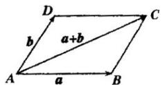

## 知识点 01 向量的加法运算

## 1、向量加法的概念及三角形法则

已知向量 $a, b$ ，在平面内任取一点 $A$ ，作 $\overline{AB} = a, \overline{BC} = b$ ，再作向量 $\overline{AC}$ ，则向量 $\overline{AC}$ 叫做 $a$ 与 $b$ 的和，记

作 $a + b$ ，即 $a + b = AB + BC = AC$ .如图

本定义给出的向量加法的几何作图方法叫做向量加法的三角形法则.

## 2、向量加法的平行四边形法则

已知两个不共线向量 $a, b$ ，作 $\overline{AB} = a, \overline{AD} = b$ ，则 $A, B, D$ 三点不共线，以 $\overline{AB}, \overline{AD}$ 为邻边作平行四边形 $ABCD$ ，则对角线 $\overline{AC} = a + b$ 。这个法则叫做两个向量求和的平行四边形法则。

求两个向量和的运算，叫做向量的加法。

对于零向量与任一向量 $a$ ，我们规定 $a + 0 = 0 + a = a$

## 3、向量求和的多边形法则的概念

已知 $n$ 个向量，依次把这 $n$ 个向量首尾相连，以第一个向量的起点为起点，第 $n$ 个向量的终点为终点的向量

叫做这 $n$ 个向量的和向量．这个法则叫做向量求和的多边形法则．

$$
A _ {1} A _ {n} = A _ {1} A _ {2} + A _ {2} A _ {3} + \dots + A _ {n - 1} A _ {n}
$$

特别地，当 $A_{1}$ 与 $A_{n}$ 重合，即一个图形为封闭图形时，有 $\overline{A_1A_2} +\overline{A_2A_3} +\dots +\overline{A_{n - 1}A_n} +\overline{A_nA_1} = 0$

## 4、向量加法的运算律

(1) 交换律： $a + b = b + a$ ;

(2) 结合律： $(a + b) + c = a + (b + c)$
