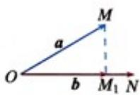

## 知识点 04 平面向量的数量积

1、平面向量数量积（内积）的定义：已知两个非零向量 $\vec{a}$ 与 $b$ ，它们的夹角是 $\theta$ ，则数量 $\left|a\right|\left|b\right|\cos \theta$ 叫 $a$ 与 $b$ 的数量积，记作 $a\cdot b$ ，即有 $a\cdot b = |a|\cdot |b|\cos \theta (0\leq \theta \leq \pi)$ .并规定0与任何向量的数量积为0.

2、如图（1），设 $a, b$ 是两个非零向量， $AB = a$ ， $CD = b$ ，作如下变换：过 $AB$ 的起点 $A$ 和终点 $B$ ，分别作 $CD$ 所在直线的垂线，垂足分别为 $A_1, B_1$ ，得到 $A_1B_1$ ，我们称上述变换为向量 $a$ 向向量 $b$ 投影， $A_1B_1$ 叫做向量 $a$ 在向量 $b$ 上的投影向量。

(1)

(2)

如图（2），在平面内任取一点 $O$ ，作 $\overline{OM} = a, \overline{ON} = b$ 。过点 $M$ 作直线 $ON$ 的垂线，垂足为 $M_1$ ，则 $\overline{OM}_1$ 就是向量 $a$ 在向量 $b$ 上的投影向量。

3、平面向量数量积的几何意义

数量积 $a \cdot b$ 表示 $a$ 的长度 $|a|$ 与 $b$ 在 $a$ 方向上的投影 $\left|b\right|\cos \theta$ 的乘积，这是 $a \cdot b$ 的几何意义。图所示分别是两向量 $a, b$ 夹角为锐角、钝角、直角时向量 $b$ 在向量 $a$ 方向上的投影的情形，其中 $OB_{1} = |b|\cos \theta$ ，它的意义是，向量 $b$ 在向量 $a$ 方向上的投影是向量 $OB_{1}$ 的数量，即 $\vec{OB}_{1} = OB_{1} \cdot \frac{a}{|a|}$ 。

(1)

(2)

(3)

事实上，当 $\theta$ 为锐角时，由于 $\cos \theta > 0$ ，所以 $OB_{1} > 0$ ；当 $\theta$ 为钝角时，由于 $\cos \theta < 0$ ，所以 $OB_{1} < 0$ ；当 $\theta = 90^{0}$ 时，由于 $\cos \theta = 0$ ，所以 $OB_{1} = 0$ ，此时 $O$ 与 $B_{1}$ 重合；当 $\theta = 0^{0}$ 时，由于 $\cos \theta = 1$ ，所以 $OB_{1} = |b|$ ；当 $\theta = 180^{0}$ 时，由于 $\cos \theta = -1$ ，所以 $OB_{1} = -|b|$ 。

## 4、向量数量积的性质

设 $a$ 与 $b$ 为两个非零向量， $e$ 是与 $b$ 同向的单位向量。

(1) $e \cdot a = a \cdot e = |a| \cos \theta$

(2) $a \perp b \Leftrightarrow a \cdot b = 0$

(3) 当 $a$ 与 $b$ 同向时， $a \cdot b = |a| \cdot |b|$ ；当 $a$ 与 $b$ 反向时， $a \cdot b = -|a||b|$ 。特别的 $a \cdot a = |a|^2$ 或 $|a| = \sqrt{a \cdot a}$ (4) $\cos \theta = \frac{a \cdot b}{|a| \cdot |b|}$ (5) $|a \cdot b| \leq |a||b|$

## 5、向量数量积的运算律

(1) 交换律： $a \cdot b = b \cdot a$

(2) 数乘结合律： $\left(\lambda a\right)\cdot b=\lambda\left(a\cdot b\right)=a\cdot\left(\lambda b\right)$

(3) 分配律： $(a+b)\cdot c=a\cdot c+b\cdot c$
