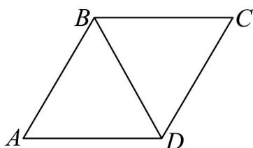

> [!faq]- 《专题6_2_平面向量的运算_高效培优讲义_》官方解析
>
> > [!success]- **【答案】** 1
>
> > [!note]- **【解析】**
> > 因为四边形 ABCD 为菱形，所以 AB = AD
> >
> > 又因为 $\angle DAB = 60^{\circ}$ ，所以 $\triangle ABD$ 是等边三角形，即 BD = AB。
> >
> > 
> >
> > 所以 $\frac{\left|\overrightarrow{AB}-\overrightarrow{AD}\right|}{\left|\overrightarrow{AB}\right|}=\frac{\left|\overrightarrow{DB}\right|}{\left|\overrightarrow{AB}\right|}=\frac{AB}{AB}=1.$
> >
> > 故答案为：1
