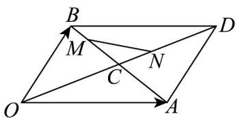
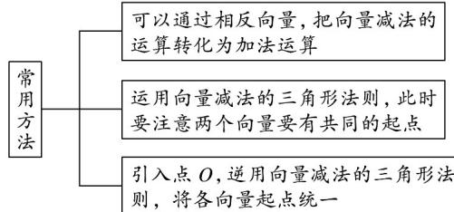

## 题型03 向量减法法则的应用

【典例1】如图所示， $OADB$ 是平行四边形， $OA = e_1$ ， $OB = e_2$ ， $C$ 是其对角线的交点， $BM = \frac{1}{3} BC$ ， $CN = \frac{1}{3} CD$

(1)试用 $e_{1}$ ， $e_{2}$ 表示向量CM，CN

(2)试用 $e_{1}$ ， $e_{2}$ 表示向量MN

【答案】(1) $CM = -\frac{1}{3}e_1 + \frac{1}{3}e_2$ , $CN = \frac{1}{6}e_1 + \frac{1}{6}e_2$

(2) $MN = \frac{1}{2} e_1 - \frac{1}{6} e_2$

【详解】（1）因为 $\frac{B M}{3} = \frac{1}{3} \frac{B C}{C}$ ，所以 $CM = \frac{2}{3} CB$

所以 $\frac{CM}{2} = \frac{1}{3}\times \frac{1}{2} AB = \frac{1}{3} AB = \frac{1}{3}\left( \begin{array}{c} \square \\ OB - OA \end{array} \right) = -\frac{1}{3} e_1 + \frac{1}{3} e_2$

$\square\square\squareCN=\frac{1}{3}\square\square CD=\frac{1}{3}\times\frac{1}{2}\square\square OD=\frac{1}{6}\square\square OD=\frac{1}{6}\left(OA+\square OB\right)=\frac{1}{6}\square\square OA+\frac{1}{6}\square OB=\frac{1}{6}e_{1}+\frac{1}{6}e_{2}$

$MN = CN - CM = \left(\frac{1}{6} e_1 + \frac{1}{6} e_2\right) - \left(-\frac{1}{3} e_1 + \frac{1}{3} e_2\right) = \frac{1}{2} e_1 - \frac{1}{6} e_2$ (2)

## 方法技巧

## 1、向量减法运算的常用方法

2、向量加减法化简的两种形式

(1) 首尾相连且为和.

(2) 起点相同且为差.

解题时要注意观察是否有这两种形式，同时注意逆向应用。

![[高中/课堂同步/题库/人教A版高中数学同步讲义(2026)/02_必修第二册/第六章 平面向量及其应用/讲义/专题6_2_平面向量的运算_高效培优讲义_/题型03_向量减法法则的应用_sec_13/questions/Q00065574.md]]
![[高中/课堂同步/题库/人教A版高中数学同步讲义(2026)/02_必修第二册/第六章 平面向量及其应用/讲义/专题6_2_平面向量的运算_高效培优讲义_/题型03_向量减法法则的应用_sec_13/questions/Q00065575.md]]
![[高中/课堂同步/题库/人教A版高中数学同步讲义(2026)/02_必修第二册/第六章 平面向量及其应用/讲义/专题6_2_平面向量的运算_高效培优讲义_/题型03_向量减法法则的应用_sec_13/questions/Q00065576.md]]
