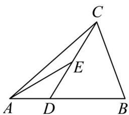

> [!faq]- 《专题6_2_平面向量的运算_高效培优讲义_》官方解析
>
> > [!success]- **【答案】**  A. $\frac{AB}{AB}=a-b$ B. $\overrightarrow{CD}=\frac{1}{3}\overrightarrow{a}+\frac{2}{3}\overrightarrow{b}$ C. $\overrightarrow{CE}=\frac{1}{3}\overrightarrow{a}+\frac{1}{3}\overrightarrow{b}$ D. $\overrightarrow{AD}=\frac{1}{3}\overrightarrow{b}-\frac{1}{3}\overrightarrow{a}$
>
> > [!note]- **【解析】**
> > 对于 A，利用三角形定则可得 $AB = AC + CB = -a + b$ ，故 A 错误，
> >
> > 对于 B，因为 $CD = CA + AD = CA + \frac{1}{3} AB = \frac{1}{3} (-a + b) + a = \frac{2}{3} a + \frac{1}{3} b$ ，故 B 错误，
> >
> > 对于 C，因为 E 是 CD 的中点，所以 $\overrightarrow{CE} = \frac{1}{2}\overrightarrow{CD} = \frac{1}{2}\left(\frac{2}{3}\overrightarrow{a} + \frac{1}{3}\overrightarrow{b}\right) = \frac{1}{3}\overrightarrow{a} + \frac{1}{6}\overrightarrow{b}$ ，故 C 错误
> >
> > 对于 D，因为 $\overrightarrow{AB}=3\overrightarrow{AD}$ ，所以 $\overrightarrow{AD}=\frac{1}{3}\overrightarrow{AB}=\frac{1}{3}(-a+b)=\frac{1}{3}\overrightarrow{b}-\frac{1}{3}\overrightarrow{a}$ ，故 D 正确.
> >
> > 故选 **D**
