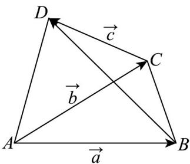

> [!faq]- 《专题6_2_平面向量的运算_高效培优讲义_》官方解析
>
> > [!success]- **【答案】**  A. $a + b - c$ B. $a - b + c$ C. $b - a + c$ D. $b - a - c$
>
> > [!note]- **【解析】**
> > 由题图可知， $BD=BC+CD=AC-AB+CD=b-a+c$
> >
> > 故选 **C**.
