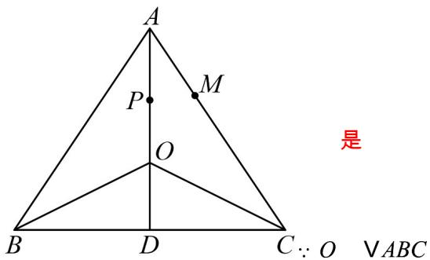

> [!faq]- 《专题6_2_平面向量的运算_高效培优讲义_》官方解析
>
> > [!success]- **【答案】** $\frac{2}{3}$
>
> > [!note]- **【解析】**
> > 设 $\overrightarrow{AP} = \frac{a}{|a|} + \frac{b}{|b|}$ ，则 P 在 $\angle BAC$ 的角平分线上，
> >
> > $$
> > \because \left(\frac {\vec {a}}{| a |} + \frac {\vec {b}}{| b |}\right) \cdot (\vec {a} - \vec {b}) = A P \cdot C B = 0
> > $$
> >
> > $\therefore AP \perp CB$ ，即 $AP \perp BC$
> >
> > 又 AP 为角平分线，所以 AB = AC ，
> >
> > $$
> > \therefore | a | = | b | = | a - b | = 2
> > $$
> >
> > 即 $\forall ABC$ 是边长为 2 的等边三角形，设 $D$ 为 $BC$ 中点，
> >
> > 
> >
> > $\therefore O$ 在 $\angle BAC$ 的角平分线上，且 $AO = \frac{2}{3} AD = \frac{2}{3}\sqrt{2^2 - 1^2} = \frac{2\sqrt{3}}{3}$
> >
> > $$
> > \left| A M \right| = \frac {1}{3} \left| A C \right| = \frac {2}{3}, \angle O A M = \frac {1}{2} \angle B A C = 3 0 ^ {\circ}
> > $$
> >
> > $$
> > \therefore \stackrel {\square \square \square} {A M} \cdot \stackrel {\square \square} {A O} = \left| A M \right| \cdot \left| A O \right| \cos 3 0 ^ {\circ} = \frac {2}{3} \times \frac {2 \sqrt {3}}{3} \times \frac {\sqrt {3}}{2} = \frac {2}{3}
> > $$
> >
> > 故答案为： $\frac{2}{3}$
