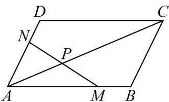

> [!faq]- 《专题6_3_平面向量基本定理及坐标表示_高效培优讲义_》官方解析
>
> > [!success]- **【答案】** 
>
> > [!note]- **【解析】**
> > 由题意可得， $AP = \lambda AC = \lambda AB + \lambda AD$
> >
> > 因为 M, N, P 三点共线，所以设 $\overline{MP} = \mu \overline{MN}$
> >
> > 则 $\frac{\square\square\square}{MP} = \mu MN = \mu \left( \frac{\square\square\square}{AN} - \frac{\square\square\square\square}{AM} \right) = \mu \left( \frac{2}{3} AD - \frac{3}{4} AB \right)$
> >
> > 则 $\overrightarrow{AP} = \overrightarrow{AM} +\overrightarrow{MP} = \frac{3}{4}\overrightarrow{AB} +\mu \left(\frac{2}{3}\overrightarrow{AD} -\frac{3}{4}\overrightarrow{AB}\right) = \frac{2}{3}\mu \overrightarrow{AD} +\left(\frac{3}{4} -\frac{3}{4}\mu\right)\overrightarrow{AB}$
> >
> > 由平面向量基本定理可得， $\frac{2}{3}\mu=\frac{3}{4}-\frac{3}{4}\mu=\lambda$ ，得 $\lambda=\frac{6}{17}$
> >
> > 故答案为： $\frac{6}{17}$
