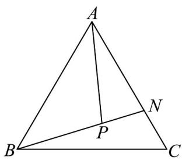

> [!faq]- 《专题6_3_平面向量基本定理及坐标表示_高效培优讲义_》官方解析
>
> > [!success]- **【答案】**  A. $\frac{1}{2}$ B. $\frac{1}{3}$ C. $\frac{1}{4}$ D. $\frac{1}{6}$
>
> > [!note]- **【解析】**
> > ∵ $AN = 2NC$
> >
> > $$
> > \therefore A N = 2 \left(A C - A N\right)
> > $$
> >
> > $$
> > \therefore A C = \frac {3}{2} A N
> > $$
> >
> > $$
> > \because A P = t A B + \frac {1}{3} A C
> > $$
> >
> > $$
> > \therefore A P = t A B + \frac {1}{3} \times \frac {3}{2} A N = t A B + \frac {1}{2} A N
> > $$
> >
> > $\because P_{是线段}BN$ 上一点，
> >
> > ∴ B, P, N
> > 三点共线，
> >
> > $$
> > \therefore t + \frac {1}{2} = 1
> > $$
> >
> > 解得 $t=\frac{1}{2}$ .
> >
> > 故选 **A**.
