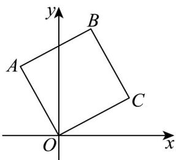

> [!faq]- 《专题6_3_平面向量基本定理及坐标表示_高效培优讲义_》官方解析
>
> > [!success]- **【答案】**  A. $\left(\sqrt{3} - 1, \sqrt{3} + 1\right)$ B. $(\sqrt{3} - 1, 1)$ C. $\left(1, \sqrt{3} + 1\right)$ D. $(\sqrt{3} - 1, 2)$
>
> > [!note]- **【解析】**
> > 设 $B(x_0, y_0)$ ，因为四边形 $ABCO$ 是正方形，所以 $\left|OB\right| = \sqrt{2}\left|OC\right|$ ，所以 $\sqrt{x_0^2 + y_0^2} = \sqrt{2} \times \sqrt{3 + 1} = 2\sqrt{2}$ ，因为 $OC \perp BC$ ，所以 $OC \cdot CB = 0$ ，又因为 $OC = (\sqrt{3}, 1), CB = (x_0 - \sqrt{3}, y_0 - 1)$ ，所以 $\sqrt{3}(x_0 - \sqrt{3}) + y_0 - 1 = 0$ ，所以 $\left\{ \begin{array}{l} \sqrt{3} x_0 + y_0 = 4 \\ x_0^2 + y_0^2 = 8 \end{array} \right.$ ，即得 $x_0^2 - 2\sqrt{3} x_0 + 2 = 0$ ，解得 $x_0 = \sqrt{3} - 1$ 或 $x_0 = \sqrt{3} + 1$ ，因为 $x_0 < \sqrt{3}$ ，所以 $x_0 = \sqrt{3} + 1$ 不
> >
> > 合题意舍去，
> >
> > 所以 $\left\{\begin{aligned}x_{0}&=\sqrt{3}-1\\ y_{0}&=\sqrt{3}+1\end{aligned}\right.$
> >
> > 所以点 $B\left(\sqrt{3}-1,\sqrt{3}+1\right)$ .
> >
> > 故选 **A**.
