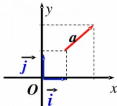

## 知识点 02 平面向量的坐标表示

1、正交分解

把一个向量分解为两个互相垂直的向量，叫做把向量正交分解．如果基底的两个基向量 $e_{1}$ 、 $e_{2}$ 互相垂直，则

$$
\begin{array}{c c} \sqcup & \sqcup \\ e _ {1} & e _ {2} \end{array}
$$

称这个基底为正交基底，在正交基底下分解向量，叫做正交分解，事实上，正交分解是平面向量基本定理的

特殊形式.

## 2、平面向量的坐标表示

如图，在平面直角坐标系内，分别取与 $x$ 轴、 $y$ 轴方向相同的两个单位向量 $i$ 、 $j$ 作为基底，对于平面上的

一个向量 $a$ ，由平面向量基本定理可知，有且只有一对实数 $x,y$ ，使得 $a = xi + yj$ 。这样，平面内的任一向量

$a$ 都可由 $x,y$ 唯一确定，我们把有序数对 $(x,y)$ 叫做向量 $a$ 的（直角）坐标，记作 $a = (x,y)$ ， $x$ 叫做 $a$ 在 $x$ 轴

上的坐标， $y$ 叫做 $a$ 在 $y$ 轴上的坐标。把 $a = (x, y)$ 叫做向量的坐标表示。给出了平面向量的直角坐标表示，

在平面直角坐标系内，每一个平面向量都可以用一有序数对唯一表示，从而建立了向量与实数的联系，为向

量运算数量化、代数化奠定了基础，沟通了数与形的联系。

（1）由向量的坐标定义知，两向量相等的充要条件是它们的坐标相等，即 $a = b \Leftrightarrow x_{1} = x_{2}$ 且 $y_{1} = y_{2}$ ，其中 $a = (x_{1},y_{1})$ ， $b = (x_{2},y_{2})$

(2) 要把点的坐标与向量坐标区别开来。相等的向量的坐标是相同的，但始点、终点的坐标可以不同。比如，若 $A(2,3)$ ， $B(5,8)$ ，则 $AB = (3,5)$ ；若 $C(-4,3)$ ， $D(-1,8)$ ，则 $CD = (3,5)$ ， $AB = CD$ ，显然 $A$ 、 $B$ 、 $C$ 、 $D$ 四点坐标各不相同。

(3) $(x, y)$ 在直角坐标系中有双重意义，它既可以表示一个固定的点，又可以表示一个向量。
