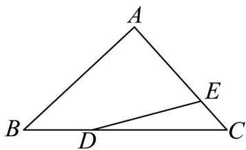

<!-- question-source:start -->
【变式2】如图，已知 $AB = a$ ， $AC = b$ ， $BC = 4BD$ ， $CA = 3CE$ ，则 $DE = (\quad)$

A. $\frac{5}{12} b - \frac{3}{4} a$ B. $2a + 3b$ C. $\frac{3}{4} a - \frac{1}{3} b$ D. $\frac{5}{12} a - \frac{3}{4} b$
<!-- question-source:end -->

![[高中/课堂同步/题库/人教A版高中数学同步讲义(2026)/02_必修第二册/第六章 平面向量及其应用/讲义/专题6_3_平面向量基本定理及坐标表示_高效培优讲义_/题型01_平面向量基本定理的理解_sec_11/questions/answers/Q00065605A1.md]]
