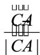

> [!faq]- 《专题6_3_平面向量基本定理及坐标表示_高效培优讲义_》官方解析
>
> > [!success]- **【答案】** A. $AB - AC = BC$ B．若向量 $a=(2023,2024)$ ，把a向右平移2个单位，得到的向量的坐标为 $(2025,2024)$ C．在VABC中， $AB \cdot AC > 0$ 是VABC为锐角三角形的充要条件 D．在VABC中，若 $\lambda$ 为任意实数，且 $\overline{CP}=\lambda\left(\left|\overline{CB}\right|\cdot\overline{CA}+\left|\overline{CA}\right|\cdot\overline{CB}\right)$ ，则P点的轨迹经过VABC的内心
>
> > [!note]- **【解析】**
> > 对于 A： $AB - AC = CB$ ，故 A 错误；
> >
> > 对于 B：向量平移后，不改变方向和模长，故平移后与平移前为相等向量，
> >
> > 故把 $a = (2023, 2024)$ 向右平移 2 个单位，得到的向量的坐标为 $(2023, 2024)$ ，故 B 错误；
> >
> > 对于 C：由 $AB \cdot AC > 0$ ，即 $AB \cdot AC = |AB| \cdot |AC| \cos \angle CAB > 0$ ，即 $\cos \angle CAB > 0$ ，
> >
> > 又 $0 < \angle CAB < \pi$ ，所以 $\angle CAB$ 为锐角，不能得到VABC为锐角三角形，故充分性不成立，
> >
> > 故 C 错误；
> >
> > 对于 D：由 $\overrightarrow{CP} = \lambda \left( \left| \overrightarrow{CB} \right| \cdot \overrightarrow{CA} + \left| \overrightarrow{CA} \right| \cdot \overrightarrow{CB} \right)$ ，可得 $\overrightarrow{CP} = \left| \overrightarrow{CA} \right| \left| \overrightarrow{CB} \right| \lambda \cdot \left( \frac{\overrightarrow{CA}}{\left| \overrightarrow{CA} \right|} + \frac{\overrightarrow{CB}}{\left| \overrightarrow{CB} \right|} \right)$
> >
> > 
> >
> > 又 $|CA|$ 表示 $CA$ 方向上的单位向量， $|CB|$ 表示 $CB$ 方向上的单位向量，
> >
> > 根据向量加法的几何意义知，以 $|CA|$ 和 $|CB|$ 为邻边的平行四边形为菱形，
> >
> > 点 P 在该菱形的对角线上，又菱形的对角线平分一组对角，
> >
> > 故 $P$ 点在 $\angle ACB$ 的平分线上，所以 $P$ 点的轨迹经过VABC的内心，故D正确·
> >
> > 故选 **D**
