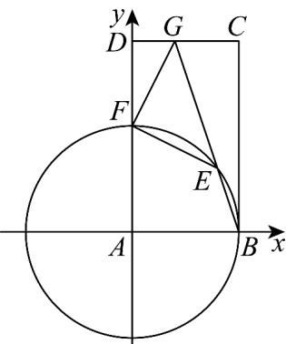

> [!faq]- 《专题6_4_平面向量的应用_高效培优讲义_》官方解析
>
> > [!success]- **【答案】** C
>
> > [!note]- **【解析】**
> > 方法一：以 A 点为坐标原点，分别以 AB、AD 方向为 x 轴正方向、y 轴正方向，建立平面直角坐标
> >
> > 系，
> >
> > 设 $|AB|=a,|AD|=b$ ，则 $A(0,0),B(a,0),D(0,b),C(a,b),F(0,b-2),G(1,b)$
> >
> > 圆 $A$ 的方程 $x^{2} + y^{2} = a^{2}$ ，则 $F(0,a)$ ，故 $a = b - 2$
> >
> > 设 $\overset{\square\square\square}{BE}=t\overset{\square\square\square}{BG}=t(1-a,b)=t(3-b,b)$ ，则 $E(3t-tb+b-2,tb)$
> >
> > 则 $\overline{FE} = (3t - tb + b - 2, tb - b + 2)$
> >
> > 因 $\left|AE\right|=a$ ，则 $(3t-tb+b-2)^{2}+(tb)^{2}=(b-2)^{2}$ ①，
> >
> > 因 $\stackrel{\mathrm{uuu}}{FG} = (1,2)$ ，则 $\stackrel{\mathrm{uuu}}{FG} \cdot \stackrel{\mathrm{uuu}}{FE} = 3t - tb + b - 2 + 2tb - 2b + 4 = 3t + tb - b + 2 = 0$
> >
> > 则 $t = \frac{b - 2}{b + 3}$ ，将其代入①式得 $\left(3\cdot \frac{b - 2}{b + 3} -b\cdot \frac{b - 2}{b + 3} +b - 2\right)^2 +\left(b\cdot \frac{b - 2}{b + 3}\right)^2 = (b - 2)^2$
> >
> > 即 $(b - 2)^{2}(6b - 27) = 0$ ，得 $b = 2$ （舍，此时 $a = 0$ ）或 $b = \frac{9}{2}$ ，则 $\left|AB\right| = a = b - 2 = \frac{5}{2}$
> >
> > 
> >
> > 方法二：因 $DF = 2, DG = 1$ ，则在 $\mathrm{Rt}^{\triangle}$ FDG中 $FG = \sqrt{FD^2 + DG^2} = \sqrt{2^2 + 1^2} = \sqrt{5}$ ，
> >
> > $$
> > \sin \angle F G D = \frac {F D}{F G} = \frac {2 \sqrt {5}}{5}, \cos \angle F G D = \frac {D G}{F G} = \frac {\sqrt {5}}{5}
> > $$
> >
> > 因 $EF \perp FG$ ， $AD \perp DC$ ，则 $\angle FGD + \angle GFD = \angle AFE + \angle GFD = 90^{\circ}$
> >
> > 则 $\angle FGD = \angle AFE$ ，有 $\sin \angle AFE = \frac{2\sqrt{5}}{5},\cos \angle AFE = \frac{\sqrt{5}}{5}$
> >
> > 过点 $E$ 作 $ME \perp AD$ ，垂足为 $M$ 交 $BC$ 于点 $N$ ；过点 $A$ 作 $AH \perp EF$ ，垂足为 $H$
> >
> > 
> >
> > 易证四边形 $ABNM$ 是矩形，则有 $MN = AB = AE = AF$ ，则有 $FH = EH$ ，设 $FH = EH = x$ ，于是有 $AF = \frac{FH}{\cos\angle AFE} = \frac{x}{\frac{\sqrt{5}}{5}} = \sqrt{5} x$ ， $MF = EF\cos \angle AFE = \frac{2\sqrt{5}}{5} x$
> >
> > $$
> > M E = E F \sin \angle A F E = \frac {4 \sqrt {5}}{5} x, E N = A F - M E = \frac {\sqrt {5}}{5} x, A M = A F - M F = \frac {3 \sqrt {5}}{5} x
> > $$
> >
> > 在矩形ABCD中，有 $CG = AF - 1 = \sqrt{5} x - 1, BC = AF + 2 = \sqrt{5} x + 2$
> >
> > 则 $\tan \angle GBC = \frac{EN}{BN} = \frac{GC}{BC}$ ，即 $\frac{\frac{\sqrt{5}x}{5}}{\frac{3\sqrt{5}x}{5}} = \frac{\sqrt{5}x - 1}{\sqrt{5}x + 2}$ ，解得 $x = \frac{\sqrt{5}}{2}$ ，即 $AB = \sqrt{5} x = \frac{5}{2}$
> >
> > 故选 **C**
