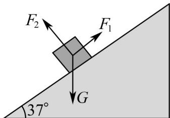

<!-- question-source:start -->
1. 如图所示，把一个物体放在倾斜角为 $37^{\circ}$ 的斜面上，物体处于平衡状态，且受到三个力的作用，即重力

$G$ ，沿着斜面向上的摩擦力 $F_{1}$ ，垂直斜面向上的弹力 $F_{2}$ ，已知 $\left|F_1\right| = 60\mathrm{N}$ 那么 $\left|G\right| =$ \_\_\_\_ N.（ $\sin 37^{\circ} \approx \frac{3}{5}$

)

<!-- question-source:end -->

![[高中/课堂同步/题库/人教A版高中数学同步讲义(2026)/02_必修第二册/第六章 平面向量及其应用/讲义/专题6_4_平面向量的应用_高效培优讲义_/即学即练_sec_06/questions/answers/Q00065640A1.md]]
