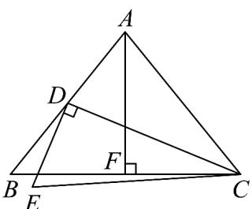
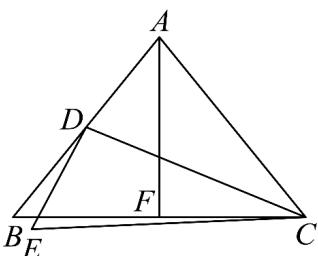

> [!faq]- 《专题6_4_平面向量的应用_高效培优讲义_》官方解析
>
> > [!success]- **【答案】** (1) $\sqrt{2}$ (2) $\left(\frac{2\sqrt{6}}{3},2\right)$
>
> > [!note]- **【解析】**
> > （1）
> >
> > 
> >
> > 取 BC 中点 F ，连接 AF ，∵ BC = 2 ，∴ BF = CF = 1
> >
> > 设 AB = 2x ，则 AD = BD = DE = x ，
> >
> > 因为 $CE = \sqrt{3},\angle EDC = \frac{\pi}{2}$ ，故 $CD = \sqrt{CE^2 - DE^2} = \sqrt{3 - x^2}$
> >
> > 因为 $AB = AC$ ，故 $AF \perp BC$ ，则 $\cos B = \cos \angle ABF = \frac{BF}{AB} = \frac{1}{2x}$
> >
> > 在 $\triangle DBC$ 中，由余弦定理可知， $\cos B = \cos \angle DBC = \frac{BD^2 + BC^2 - CD^2}{2 \cdot BD \cdot BC} = \frac{x^2 + 4 - (3 - x^2)}{2 \cdot x \cdot 2} = \frac{2x^2 + 1}{4x}$
> >
> > 因此有 $\frac{1}{2x} = \frac{2x^{2} + 1}{4x}$ ，解得 $x = \frac{\sqrt{2}}{2}$ ，
> >
> > 故 $AB = 2x = \sqrt{2}$
> >
> > (2)
> >
> > 
> >
> > 设 $AB = 2x$ ，则 $AD = BD = DE = x$ ，设 $DC = m$
> >
> > 设 $\overline{DE}=a,\overline{DC}=b$ ，则 $|a|=x,|b|=m$ ， $\overline{CE}=DE-DC=a-b$ 。
> >
> > 由 $|\overline{CE}| = \sqrt{6}$ ，得 $(a - b)^2 = |a|^2 + |b|^2 - 2a \cdot b = 6$ ，得 $|a|^2 + |b|^2 - 6 = 2a \cdot b$
> >
> > 因 $\angle EDC$ 为钝角，故 $a \cdot b = |a||b|\cos\theta < 0$
> >
> > 可得 $x^{2} + m^{2} - 6 <   0$
> >
> > 由余弦定理可知，在 $\triangle BAC$ 中， $\cos \angle BAC = \frac{4x^2 + 4x^2 - 4}{8x^2} = 1 - \frac{1}{2x^2}$
> >
> > 在 $\triangle DAC$ 中， $\cos \angle BAC = \cos \angle DAC = \frac{x^2 + 4x^2 - m^2}{4x^2}$
> >
> > 因此有 $1 - \frac{1}{2x^2} = \frac{x^2 + 4x^2 - m^2}{4x^2}$ ，整理得 $x^{2} = m^{2} - 2 > 0$ ，得 $m > \sqrt{2}$ ， $m > x$ ，
> >
> > 故 $x^{2} + m^{2} - 6 = 2m^{2} - 8 < 0$ ，解得 $0 < m < 2$ ，即 $m \in (\sqrt{2}, 2)$ .
> >
> > 同时，在 $\triangle EDC$ 中，有两边之和大于第三边：
> >
> > 故有： $ED + EC > DC$ ，即 $x + \sqrt{6} > m$ ，因为 x > 0, m < 2，故 $ED + EC > DC$ 恒成立；
> >
> > $CD + CE > DE$ ，即 $m + \sqrt{6} > x$ ，因为 m > x，故 $CD + CE > DE$ 恒成立；
> >
> > $DC + DE > CE$ ，即 $m + x > \sqrt{6}$ ，即 $m + \sqrt{m^2 - 2} > \sqrt{6}$ ， $\sqrt{m^2 - 2} > \sqrt{6} - m$ ，两边平方后，整理得 $m > \frac{2\sqrt{6}}{3}$
> >
> > 综上所述， $m = DC \in (\frac{2\sqrt{6}}{3}, 2)$
