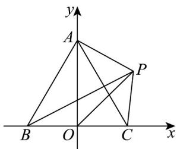

> [!faq]- 《专题6_4_平面向量的应用_高效培优讲义_》官方解析
>
> > [!success]- **【答案】** A. -8 B. $-\frac{3}{2}$ C. $-\frac{16}{3}$ D. -4
>
> > [!note]- **【解析】**
> > 以 BC 中点 O 为坐标原点，以 BC, OA 为正方向为 x, y 轴，建立如图所示的直角坐标系，
> > 设 $P(x,y)$ ，则 $O(O,O), A(0,\sqrt{3})$ ,
> > 故 $PA\cdot(\overline{PB}+\overline{PC})=2PA\cdot\overline{PO}=2(-x,\sqrt{3}-y)\cdot(-x,-y)=2(x^{2}+y^{2}-\sqrt{3}y)$ $=2\left[x^{2}+\left(y-\frac{\sqrt{3}}{2}\right)^{2}-\frac{3}{4}\right]\quad2\times\left(-\frac{3}{4}\right)=-\frac{3}{2}$ ，当 $x=0,y=\frac{\sqrt{3}}{2}$ 时取到等号，
> >
> > 故选：B
> >
> > 
