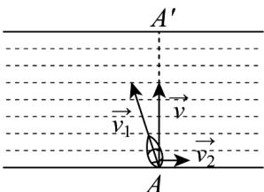

<!-- question-source:start -->
【变式1】如图所示，一条河两岸平行，河的宽度为400米，一艘船从河岸的A地出发，向河对岸航行．已知船的速度 $v_{1}$ 的大小为 $\left|\begin{matrix}\bar{u}\\ v_{1}\end{matrix}\right|=8km/h$ ，水流速度 $v_{2}$ 的大小为 $\left|\begin{matrix}\bar{u}\\ v_{2}\end{matrix}\right|=2km/h$ ，船的速度与水流速度的合速度为v，
那么当航程最短时，下列说法正确的是（）

A. 船头方向与水流方向垂直 B. $\cos\left\langle v_{1},v_{2}\right\rangle=-\frac{1}{4}$ C. $\left|v\right|=2\sqrt{17}km/h$ D. 该船到达对岸所需时间为3分钟
<!-- question-source:end -->

![[高中/课堂同步/题库/人教A版高中数学同步讲义(2026)/02_必修第二册/第六章 平面向量及其应用/讲义/专题6_4_平面向量的应用_高效培优讲义_/题型02_向量在物理中的应用_sec_12/questions/answers/Q00065647A1.md]]
