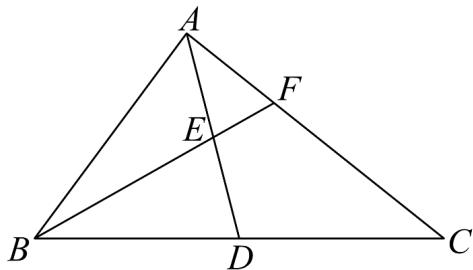

<!-- question-source:start -->
【变式1】如图，在VABC中，AB=4，AC=6， $BC=2\sqrt{19}$ .取BC边中点D，连接AD，设E为AD中点，

连接 BE 并延长与 VABC 交于点 F，则 EF 的长为 \_\_\_\_.

$$
\frac {\sqrt {7}}{2}
$$
<!-- question-source:end -->

![[高中/课堂同步/题库/人教A版高中数学同步讲义(2026)/02_必修第二册/第六章 平面向量及其应用/讲义/专题6_4_平面向量的应用_高效培优讲义_/题型03_解三角形_sec_13/questions/answers/Q00065650A1.md]]
