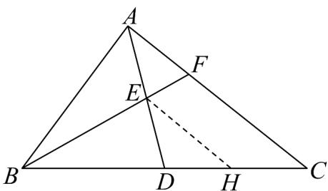

> [!faq]- 《专题6_4_平面向量的应用_高效培优讲义_》官方解析
>
> > [!success]- **【答案】** 2
>
> > [!note]- **【解析】**
> > 如图：
> >
> > 
> >
> > 作 EH // FC 交 BC 于点 H ，
> >
> > 因为点 $E$ 为 $AD$ 中点，所以点 $H$ 为 $DC$ 中点，即 $HD = HC$
> >
> > 因为 D 为 BC 中点，所以 BH = 3HC ，因此 BE = 3EF ，
> >
> > 在VABC中，因为 $AB = 4$ ， $AC = 6$ ， $BC = 2\sqrt{19}$
> >
> > 所以由余弦定理可得 $\cos\angle ABD=\frac{AB^{2}+BC^{2}-AC^{2}}{2AB\cdot BC}=\frac{4^{2}+\left(2\sqrt{19}\right)^{2}-6^{2}}{2\times4\times2\sqrt{19}}=\frac{7\sqrt{19}}{38}$
> >
> > 因为 $E$ 为 $AD$ 中点，所以 $\overline{BE} = \frac{1}{2}\left(\overline{BA} +\overline{BD}\right)$
> >
> > 因此 $\left|\overline{BE}\right|^2 = \frac{1}{4}\left(\overline{BA} +\overline{BD}\right)^2 = \frac{1}{4}\left(\left|\overline{BA}\right|^2 +\left|\overline{BD}\right|^2 +2\overline{BA}\cdot \overline{BD}\right) = \frac{1}{4}\left(\left|\overline{BA}\right|^2 +\left|\overline{BD}\right|^2 +2\left|\overline{BA}\right|\cdot \left|\overline{BD}\right|\cos \angle ABD\right)$
> >
> > 又因为 $BD = \frac{1}{2} BC = \sqrt{19}$
> >
> > 所以 $\left|\overrightarrow{BE}\right|^{2}=\frac{1}{4}\left(\left|\overrightarrow{BA}\right|^{2}+\left|\overrightarrow{BD}\right|^{2}+2\left|\overrightarrow{BA}\right|\cdot\left|\overrightarrow{BD}\right|\cos\angle ABD\right)=\frac{1}{4}\left(4^{2}+\left(\sqrt{19}\right)^{2}+2\times4\times\sqrt{19}\times\frac{7\sqrt{19}}{38}\right)=\frac{63}{4}$
> >
> > 所以 $\left|\stackrel{\square\square\square}{BE}\right|=\sqrt{\frac{63}{4}}=\frac{3\sqrt{7}}{2}$ ，因此 $EF=\frac{1}{3}BE=\frac{\sqrt{7}}{2}$ .
> >
> > 故答案为： $\frac{\sqrt{7}}{2}$
