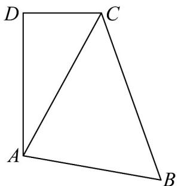

<!-- question-source:start -->
【变式3】如图四边形 ABCD 中，BC = 2CD = 8, AB = AD = 6

(1)若VABC的面积为 $8\sqrt{5}$ ，且B为锐角，求AC的长度.

(2)试问 $2\cos B - \cos D$ 是否为定值？若是，求出这个定值；若不是，请说明理由，

(3)求四边形ABCD面积的最大值.
<!-- question-source:end -->

![[高中/课堂同步/题库/人教A版高中数学同步讲义(2026)/02_必修第二册/第六章 平面向量及其应用/讲义/专题6_4_平面向量的应用_高效培优讲义_/题型05_证明三角形中的恒等式及不等式_sec_15/questions/answers/Q00065658A1.md]]
