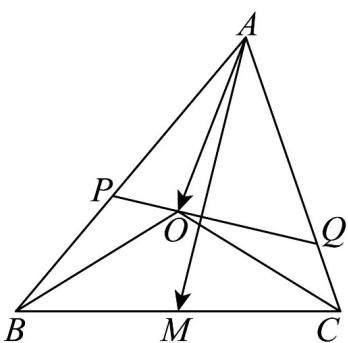

## 题型05 证明三角形中的恒等式及不等式

【典例1】已知平面内一三角形 $ABC$ ，点 $O$ 为其外心

(1)点M为边BC的中点，AB=5，AC=7，求 $AM\cdot AO$ 的值；

(2)若过点 $O$ 的直线分别交边 $AB$ 、 $AC$ 于点 $P$ 、 $Q$ ，证明： $\frac{AB}{AP} \cdot \sin 2B+$

$$
\frac {A C}{A Q} \cdot \sin 2 C = \sin 2 A + \sin 2 B + \sin 2 C
$$

【答案】(1) $\frac{37}{2}$

(2)证明见解析

【详解】（1） $AM \cdot AO = \frac{1}{2}\left(AB + AC\right) \cdot AO = \frac{1}{2}\left(AB \cdot AO + AC \cdot AO\right)$

由数量积几何意义可得： $AB\cdot AO = \left|AB\right|\left|AO\right|\cos \angle BAO = \frac{1}{2}\left|AB\right|^2 = \frac{1}{2} AB^2$

同理得 $AC \cdot AO = \frac{1}{2} AC^{2}$

则 $\frac{AM}{AO} = \frac{1}{4}AB^{2} + \frac{1}{4}AC^{2} = \frac{1}{4} \times (5^{2} + 7^{2}) = \frac{37}{2}$ ;

(2) 证明：设三角形 $ABC$ 外接圆半径为 $R$ ，

$$
S _ {\triangle A P O} = \frac {1}{2} A P \cdot A O \cdot \sin \angle P A O, S _ {\triangle A B O} = \frac {1}{2} A B \cdot A O \cdot \sin \angle B A O.
$$

$$
\text {因} \sin \angle P A O = \sin \angle B A O, \text {所以} S _ {\triangle A P O} = \frac {A P}{A B} \cdot S _ {\triangle A B O}.
$$

$$
S _ {\triangle A Q O} = \frac {A Q}{A C} \cdot S _ {\triangle O A C}, \text {所以} S _ {\triangle A P Q} = \frac {A P}{A B} \cdot S _ {\triangle O A B} + \frac {A Q}{A C} \cdot S _ {\triangle O A C},
$$

$$
\text {又} \because S _ {\triangle A P Q} = \frac {1}{2} A P \cdot A Q \cdot \sin \angle P A Q, S _ {\triangle A B C} = \frac {1}{2} A B \cdot A C \cdot \sin \angle B A C, \angle P A Q = \angle B A C.
$$

$$
\text {则} \frac {S _ {\triangle A P Q}}{S _ {\triangle B A C}} = \frac {A P \cdot A Q}{A B \cdot A C} \Rightarrow S _ {\triangle A P Q} = \frac {A P \cdot A Q}{A B \cdot A C} S _ {\triangle B A C}.
$$

$$
\therefore \frac {A P}{A B} \cdot S _ {\triangle O A B} + \frac {A Q}{A C} \cdot S _ {\triangle O A C} = \frac {A P}{A B} \cdot \frac {A Q}{A C} \cdot S _ {\triangle A B C}
$$

$$
\text { 故 } \frac {A C}{A Q} \cdot S _ {\triangle O A B} + \frac {A B}{A P} \cdot S _ {\triangle O A C} = S _ {\triangle A B C} \tag {①}
$$

∵点 O 为三角形 ABC 的外心，∴ $\angle AOB = 2\angle ACB = 2C$ ， $\angle AOC = 2\angle ABC = 2B$

$$
\angle B O C = 2 \angle B A C = 2 A, \therefore S _ {\triangle A O B} = \frac {1}{2} O A \cdot O B \cdot \sin \angle A O B = \frac {1}{2} R ^ {2} \sin 2 C,
$$

$$
\text {同理} S _ {\triangle A O C} = \frac {1}{2} R ^ {2} \sin 2 B, S _ {\triangle B O C} = \frac {1}{2} R ^ {2} \sin 2 A.
$$

$$
\text {则} S _ {\triangle A B C} = \frac {1}{2} R ^ {2} (\sin 2 A + \sin 2 B + \sin 2 C).
$$

代入上式①中，结合 $S_{\triangle AOB}=\frac{1}{2}R^{2}\sin2C$ ， $S_{\triangle AOC}=\frac{1}{2}R^{2}\sin2B$ 可得：

$$
\frac {A C}{A Q} \cdot \frac {1}{2} R ^ {2} \sin 2 C + \frac {A B}{A P} \cdot \frac {1}{2} R ^ {2} \sin 2 B = S _ {\triangle A B C} = \frac {1}{2} R ^ {2} (\sin 2 A + \sin 2 B + \sin 2 C)
$$

$$
\frac {A C}{A Q} \cdot \sin 2 C + \frac {A B}{A P} \cdot \sin 2 B = \sin 2 A + \sin 2 B + \sin 2 C \text {所以}
$$

![[高中/课堂同步/题库/人教A版高中数学同步讲义(2026)/02_必修第二册/第六章 平面向量及其应用/讲义/专题6_4_平面向量的应用_高效培优讲义_/题型05_证明三角形中的恒等式及不等式_sec_15/questions/Q00065656.md]]
![[高中/课堂同步/题库/人教A版高中数学同步讲义(2026)/02_必修第二册/第六章 平面向量及其应用/讲义/专题6_4_平面向量的应用_高效培优讲义_/题型05_证明三角形中的恒等式及不等式_sec_15/questions/Q00065657.md]]
![[高中/课堂同步/题库/人教A版高中数学同步讲义(2026)/02_必修第二册/第六章 平面向量及其应用/讲义/专题6_4_平面向量的应用_高效培优讲义_/题型05_证明三角形中的恒等式及不等式_sec_15/questions/Q00065658.md]]
