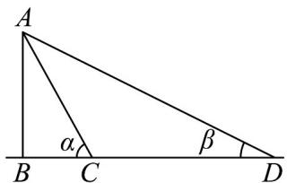
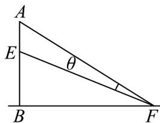

<!-- question-source:start -->
【变式3】与江苏省首批高品质示范高中江苏省常州高级中学毗邻的天宁宝塔，是世界第一高佛塔，是常州

标志性建筑之一，也是该校师生喜欢的摄影取景胜地。该校高一某研究性学习小组去测量天宁宝塔 $AB$ 的高度，

该小组同学在塔底 $B$ 的东南方向上选取两个测量点 $C$ 与 $D$ ，测得 $CD = 230$ 米，在 $C$ 、 $D$ 两处测得塔顶的仰角

分别为 $\angle ACB = \alpha = 63^{\circ}$ ， $\angle ADB = \beta = 27^{\circ}$ （如图），已知 $\tan 63^{\circ}\tan 27^{\circ} = 1,\tan 63^{\circ}\approx 1.96,\tan 27^{\circ}\approx 0.51$

(1)请计算天宁宝塔 $AB$ 的高度（四舍五入保留整数）；

(2)为庆祝某重大节日，在塔上 $A$ 到 $E$ 处设计特殊的“灯光秀”以烘托节日气氛.知 $AE = 53$ 米，塔高 $AB$ 直接取

(1) 的整数结果，市民在塔底 $B$ 的东南方向的 $F$ 处欣赏“灯光秀”（如图），请问当 $BF$ 为多少米时，欣赏“灯

光秀”的视角 $\theta$ 最大？（结果保留根式）
<!-- question-source:end -->

![[高中/课堂同步/题库/人教A版高中数学同步讲义(2026)/02_必修第二册/第六章 平面向量及其应用/讲义/专题6_4_平面向量的应用_高效培优讲义_/题型08_几何问题_sec_18/questions/answers/Q00065667A1.md]]
