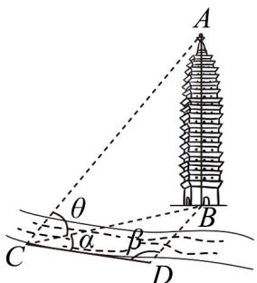

> [!faq]- 《专题6_4_平面向量的应用_高效培优讲义_》官方解析
>
> > [!success]- **【答案】** $\theta = 30^{\circ}$ ，往正东方向前进 $90\mathrm{m}$ 到达 $D$ 处，测得该塔在北偏西 $45^{\circ}$ 方向，底部 $^B$ 和 $C,D$ 在同一水平面内，则该 建筑物的高 $AB$ 为（）  A. $30\sqrt{2}\mathrm{m}$ B. $30\sqrt{3}\mathrm{m}$ C. $90\sqrt{2}\mathrm{m}$ D. $30\sqrt{6}\mathrm{m}$
>
> > [!note]- **【解析】**
> > 由题设及图知： $\alpha = 15^{\circ},\beta = 45^{\circ}$ ，则 $\angle CBD = 120^{\circ}$
> >
> > 在 $\triangle BCD$ 中 $\frac{CD}{\sin\angle CBD} = \frac{BC}{\sin\beta}$ ，可得 $BC = 30\sqrt{6}\mathrm{m}$
> >
> > 又 $\tan\theta=\frac{AB}{BC}=\frac{1}{\sqrt{3}}$ ，可得 $AB=30\sqrt{2}m$ .
> >
> > 故选 **A**
