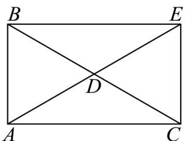

> [!faq]- 《第六章_平面向量及其应用_高效培优讲义_》官方解析
>
> > [!success]- **【答案】** B
>
> > [!note]- **【分析】**
> > 利用平面向量数量积的运算性质可求出 $\lambda$ 的值，分析可知 D 为 BC 的中点，即可求出 BD 的长·
>
> > [!note]- **【解析】**
> > 在 $\forall ABC$ 中， $AB = 1$ ， $AC = \sqrt{3}$ ， $\angle BAC = 90^{\circ}$ ，则 $AB\cdot AC = 0$
> >
> > 因为 $\overline{AE} = (2 - \lambda)\overline{AB} + \lambda\overline{AC}$
> >
> > 则 $\left|\overline{AE}\right|^2 = \left[(2 - \lambda)\overline{AB} +\lambda \overline{AC}\right]^2 = (2 - \lambda)^2\overline{AB}^2 +\lambda^2\overline{AC}^2 +2\lambda (2 - \lambda)\overline{AB}\cdot \overline{AC}$
> >
> > $$
> > = (2 - \lambda) ^ {2} + 3 \lambda^ {2} = 4 \lambda^ {2} - 4 \lambda + 4 = 4
> > $$
> >
> > 整理可得 $\lambda(\lambda-1)=0$ ，解得 $\lambda=0$ 或 $\lambda=1$ ，
> >
> > 当 $\lambda = 0$ 时，则 $AE = 2AB$ ，此时点 $B$ 为 $AE$ 的中点，
> >
> > 由题意可知点 D 为线段 AE 与 BC 的交点，即点 D 与点 B 重合，不符合题意，
> >
> > 当 $\lambda=1$ 时， $AE=\overline{AB}+\overline{AC}$ ，由题意可知，四边形 ABEC 为矩形，
> >
> > 因为 $D$ 为线段 $AE$ 与 $BC$ 的交点，则 $D$ 为 $BC$ 的中点，
> >
> > 故 $BD = \frac{1}{2} BC = \frac{1}{2}\sqrt{AB^2 + AC^2} = \frac{1}{2}\times \sqrt{1 + 3} = 1$
> >
> > 
> >
> > 故选：B.
> >
> > 2. 化简：
> >
> > (1) $\left(AB - BM\right) + BO + OM =$
> >
> > (2) $NQ + QP + MN + PM = \_\_\_\_$ .
> >
> > 【答案】 $AB$ 0
> >
> > 【分析】由向量的线性运算即可求解·
> >
> > 【详解】（1） $\left(AB-BM\right)+BO+OM=\left(AB-BM\right)+\left(BO+OM\right)=\left(AB-BM\right)+BM=AB$ ；
> >
> > $$
> > (2) N Q + Q P + M N + P M = N P + P M + M N = N M + M N = 0.
> > $$
> >
> > 故答案为：① $AB$ ；
> > - **②**：0.
