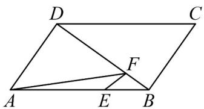

<!-- question-source:start -->
1. 如图，在平行四边形 $ABCD$ 中， $AE = 2EB$ ， $DF = 3FB$ ，设 $AB = a$ ， $AD = b$ 。注：本小题几何方法求解不

得分.

(1)用 a, b 表示 $BD$ , $AF$ ;

(2)用平面向量证明： $E$ ， $F$ ， $C$ 三点共线.
<!-- question-source:end -->

![[高中/课堂同步/题库/人教A版高中数学同步讲义(2026)/02_必修第二册/第六章 平面向量及其应用/讲义/第六章_平面向量及其应用_高效培优讲义_/即学即练_sec_07/questions/answers/Q00065714A1.md]]
