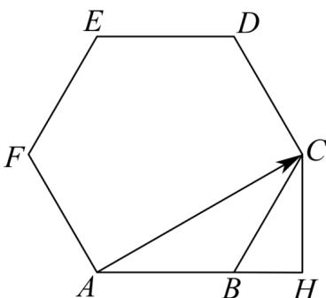

> [!faq]- 《第六章_平面向量及其应用_高效培优讲义_》官方解析
>
> > [!success]- **【答案】** A. 4 B. $4\sqrt{3}$ C. 6 D. $6\sqrt{3}$
>
> > [!note]- **【分析】**
> > 利用数量积的几何意义，结合图形分析即可得解·
>
> > [!note]- **【解析】**
> > 因为 $AB \cdot AP = |AB| |AP|\cos AB, AP$
> >
> > 如图，过点 $C$ 作 $CH \perp AB$
> >
> > 
> >
> > 由图可知，当 P 与点 C 重合时，向量 $\stackrel{\cup\cup}{AP}$ 在 $\stackrel{\cup\cup}{AB}$ 上的投影 $\left|\stackrel{\cup\cup}{AP}\right| \cos AB, \stackrel{\cup\cup}{AP}$ 取得最大值，
> >
> > 此时 $AB \cdot AP$ 取得最大值，则 $AB \cdot AP = |AB| |AP|\cos AB, AP = |AB| \cdot |AH|$ ，
> >
> > 因为 $AB = BC = 2, \angle CBH = \frac{\pi}{3}$ ，则 $BH = 1$ ， $AH = 3$ ，
> >
> > 所以 $\overline{AP} \cdot \overline{AB} = \left| AH \right| \cdot \left| AB \right| = 3 \times 2 = 6$ .
> >
> > 故选 **C**.
