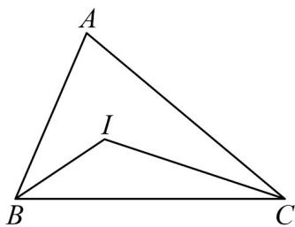

> [!faq]- 《第六章_平面向量及其应用_高效培优讲义_》官方解析
>
> > [!success]- **【答案】** (1) $A = \frac{\pi}{3}$ (2) $\left(4,2+\frac{4\sqrt{3}}{3}\right]$
>
> > [!note]- **【分析】**
> > （1）利用二倍角的余弦公式以及正弦定理化简得出 $b^{2} + c^{2} - a^{2} = bc$ ，结合余弦定理可求出 $\cos A$ 的
> >
> > 值，再由角 A 的取值范围可得出角 A 的值；
> >
> > (2)
> > 解法一：求出 $\angle BIC = \frac{2\pi}{3}$ ，利用余弦定理结合基本不等式可求出 $IB + IC$ 的最大值，再利用三角形三边
> >
> > 关系可得出 $IB + IC$ 的取值范围，即可得出 $\triangle IBC$ 周长的取值范围；
> >
> > 解法二：求出 $\angle BIC = \frac{2\pi}{3}$ ，设 $\angle ABC = \theta$ ，求出 $\theta$ 的取值范围，利用正弦定理结合三角恒等变换化简得出
> >
> > $IB + IC = \frac{4\sqrt{3}}{3}\sin \left(\frac{\theta}{2} +\frac{\pi}{3}\right)$ ，利用正弦函数的基本性质可求出 $IB + IC$ 的取值范围，进而可得出△IBC周长的取
> >
> > 值范围·
>
> > [!note]- **【解析】**
> > （1）因为 $\cos 2B + \cos 2C + 2\sin B\sin C = 1 - 2\sin^2 B + 1 - 2\sin^2 C + 2\sin B\sin C = 2 - 2\sin^2 A$
> >
> > 整理可得 $\sin^2 B + \sin^2 C - \sin^2 A = \sin B\sin C$
> >
> > 由正弦定理可得 $b^{2} + c^{2} - a^{2} = bc$
> >
> > 由余弦定理可得 $\cos A = \frac{b^{2} + c^{2} - a^{2}}{2bc} = \frac{1}{2}$ ，
> >
> > 因为 $A \in (0, \pi)$ ，故 $A = \frac{\pi}{3}$ .
> >
> > (2) 方法一：因为 $\forall ABC$ 的内心为 $I$ ，所以 $IB$ 和 $IC$ 分别平分 $\angle ABC$ 和 $\angle ACB$
> >
> > 可得 $\angle IBC + \angle ICB = \frac{1}{2}\left(\angle ABC + \angle ACB\right) = \frac{1}{2}\left(\pi -\frac{\pi}{3}\right) = \frac{\pi}{3}$ ，则 $\angle BIC = \frac{2\pi}{3}$
> >
> > 
> >
> > 设 $IC = m$ ， $IB = n$ ，在 $\triangle IBC$ 中，由余弦定理得 $BC^2 = IC^2 + IB^2 - 2IC \cdot IB\cos \frac{2\pi}{3}$
> >
> > 即 $m^2 + n^2 - 2mn\cos \frac{2\pi}{3} = 2^2 = 4$ ，即 $m^2 + n^2 + mn = 4$ ，整理得 $(m + n)^2 = 4 + mn$ ，
> >
> > 因为 $m > 0$ 且 $n > 0$ ，由基本不等式可得 $\left(m + n\right)^2 = 4 + mn \leq 4 + \frac{\left(m + n\right)^2}{4}$
> >
> > 可得 $\left(m+n\right)^{2}\leq\frac{16}{3}$ ，即 $m+n\leq\frac{4\sqrt{3}}{3}$
> >
> > 当且仅当 $m = n = \frac{2\sqrt{3}}{3}$ 时，即 $IB = IC = \frac{2\sqrt{3}}{3}$ 时等号成立，
> >
> > 又因为 $m + n > a = 2$ ，所以 $2 < m + n \leq \frac{4\sqrt{3}}{3}$ ，故 $4 < m + n + a \leq 2 + \frac{4\sqrt{3}}{3}$
> >
> > 综上所述， $\triangle IBC$ 的周长的取值范围为 $\left(4,2 + \frac{4\sqrt{3}}{3}\right)$ ；
> >
> > 方法二：因为 $\forall ABC$ 的内心为 $I$ ，所以 $IB$ 和 $IC$ 分别平分 $\angle ABC$ 和 $\angle ACB$
> >
> > 可得 $\angle IBC + \angle ICB = \frac{1}{2}\left(\angle ABC + \angle ACB\right) = \frac{1}{2}\left(\pi -\frac{\pi}{3}\right) = \frac{\pi}{3}$ ，则 $\angle BIC = \frac{2\pi}{3}$
> >
> > 设 $\angle ABC = \theta$ ，则有 $\angle ACB = \frac{2\pi}{3} -\theta$ ，则 $\angle IBC = \frac{\theta}{2}$ ， $\angle ICB = \frac{\pi}{3} -\frac{\theta}{2}$
> >
> > 由 $\left\{\begin{aligned}0&<\theta<\pi\\ 0&<\frac{2\pi}{3}-\theta<\pi\end{aligned}\right.$ ，可得 $0<\theta<\frac{2\pi}{3}$ ，
> >
> > 在 $\triangle IBC$ 中， $BC = 2$ ，由正弦定理得 $\frac{BC}{\sin\frac{2\pi}{3}} = \frac{IC}{\sin\frac{\theta}{2}} = \frac{IB}{\sin\left(\frac{\pi}{3} - \frac{\theta}{2}\right)}$
> >
> > $$
> > I C = \frac {4 \sqrt {3}}{3} \sin \frac {\theta}{2}, I B = \frac {4 \sqrt {3}}{3} \sin \left(\frac {\pi}{3} - \frac {\theta}{2}\right)
> > $$
> >
> > 可得 $IB + IC = \frac{4\sqrt{3}}{3}\left[\sin \left(\frac{\pi}{3} -\frac{\theta}{2}\right) + \sin \frac{\theta}{2}\right] = \frac{4\sqrt{3}}{3}\left(\frac{\sqrt{3}}{2}\cos \frac{\theta}{2} -\frac{1}{2}\sin \frac{\theta}{2} +\sin \frac{\theta}{2}\right)$
> >
> > $$
> > = \frac {4 \sqrt {3}}{3} \left(\frac {1}{2} \sin \frac {\theta}{2} + \frac {\sqrt {3}}{2} \cos \frac {\theta}{2}\right) = \frac {4 \sqrt {3}}{3} \sin \left(\frac {\theta}{2} + \frac {\pi}{3}\right)
> > $$
> >
> > 根据 $0 < \theta < \frac{2\pi}{3}$ ， $\frac{\pi}{3} < \frac{\theta}{2} + \frac{\pi}{3} < \frac{2\pi}{3}$ ，所以 $\sin \left(\frac{\theta}{2} + \frac{\pi}{3}\right) \in \left(\frac{\sqrt{3}}{2}, 1\right]$
> >
> > 可得 $\frac{4\sqrt{3}}{3}\sin\left(\frac{\theta}{2}+\frac{\pi}{3}\right)\in\left(2,\frac{4\sqrt{3}}{3}\right]$ ，所以 $4<IB+IC+BC\leq2+\frac{4\sqrt{3}}{3}$ ，
> >
> > 所以 $\triangle ABC$ 的周长范围为 $\left(4,2 + \frac{4\sqrt{3}}{3}\right]$
