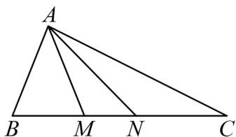

<!-- question-source:start -->
1. 如图，一艘船向正东航行，顺次经过观测点 $B$ ， $M$ ， $N$ ， $C$ ，船航行到 $B$ 处，在 $B$ 处观测灯塔 $A$ 在船的北偏

东 $30^{\circ}$ 的方向上，船航行到 $C$ 处，在 $C$ 处观测灯塔在船的北偏西 $60^{\circ}$ 的方向上，已知 $B$ ， $C$ 相距6海里，

$$
\angle M A N = 3 0 ^ {\circ}
$$

(1)若 $\sin\angle BAM=\frac{\sqrt{21}}{7}$ ，求MN的距离；

(2)求 $\triangle AMN$ 面积的最小值.
<!-- question-source:end -->

![[高中/课堂同步/题库/人教A版高中数学同步讲义(2026)/02_必修第二册/第六章 平面向量及其应用/讲义/第六章_平面向量及其应用_高效培优讲义_/即学即练_sec_22/questions/answers/Q00065726A1.md]]
