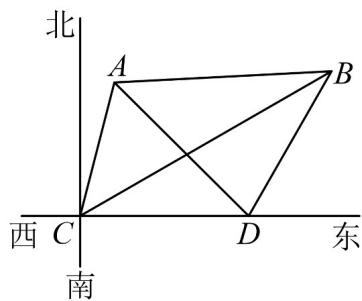

<!-- question-source:start -->
2．如图所示，一艘海轮在海面上的 C 处发现两座小岛 A, B，测得小岛 A 在 C 的北偏东 $15^{\circ}$ 的方向上，小岛 B

在 $C$ 的北偏东 $60^{\circ}$ 的方向上，海轮从 $C$ 处向正东方向航行 $10\sqrt{3}$ 海里后到达 $D$ 处，测得小岛 $A$ 在 $D$ 的北偏西

$45^{\circ}$ 的方向上，小岛 $^{B}$ 在 $^{D}$ 的北偏东 $30^{\circ}$ 的方向上·

(1)求 $C$ 处与小岛 $A$ 之间的距离；

(2)求 A, B 两座小岛之间的距离.
<!-- question-source:end -->

![[高中/课堂同步/题库/人教A版高中数学同步讲义(2026)/02_必修第二册/第六章 平面向量及其应用/讲义/第六章_平面向量及其应用_高效培优讲义_/即学即练_sec_22/questions/answers/Q00065727A1.md]]
