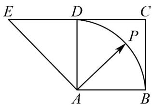

<!-- question-source:start -->
5．如图，四边形ABCD是正方形，延长CD至E，使DE=CD，若点P是以点A为圆心，AB为半径的圆弧

（不超出正方形）上的任一点，设向量 $\overline{AP} = \lambda \overline{AB} + \mu \overline{AE}$ ，则 $\lambda + \mu$ 的最小值为\_\_\_\_最大值为\_\_\_\_。

<!-- question-source:end -->

![[高中/课堂同步/题库/人教A版高中数学同步讲义(2026)/02_必修第二册/第六章 平面向量及其应用/讲义/第六章_平面向量及其应用_高效培优讲义_/强化训练_sec_38/questions/answers/Q00065773A1.md]]
