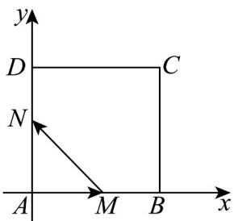

> [!faq]- 《第六章_平面向量及其应用_高效培优讲义_》官方解析
>
> > [!success]- **【答案】** C
>
> > [!note]- **【分析】**
> > 以点 A 为原点，建立平面直角坐标系，设 $M(a,0)(0 \leq a \leq 2)$ 和 $N(0,e)$ ，利用向量的数量积的坐标运
> >
> > 算公式，得到 $AM \cdot MN = -a^2$ ，即可求解·
>
> > [!note]- **【解析】**
> > 以点 A 为原点，以 AB 和 AD 所在直线分别为 x 轴和 y 轴，建立平面直角坐标系，
> >
> > 如图所示，设 $M(a,0)(0 \leq a \leq 2)$ ， $N(0,e)(0 \leq e \leq 2)$
> >
> > 可得 $AM = (a, 0)$ , MN = (-a, e), 则 $AM \cdot MN = -a^{2} \in [-4, 0]$
> >
> > 故选C.
> >
> > 
