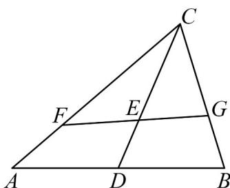

> [!faq]- 《第六章_平面向量及其应用_高效培优讲义_》官方解析
>
> > [!success]- **【答案】** $$ \frac {1}{3} a + \frac {1}{3} b; \quad \frac {2 \sqrt {3}}{3}. $$
>
> > [!note]- **【分析】**
> > 根据向量的线性运算法则，即可求得答案；根据线性运算法则，结合三点共线的性质，可得
> >
> > $\frac{1}{3m}+\frac{1}{3n}=1$ ，结合基本不等式，即可得答案·
>
> > [!note]- **【解析】**
> > 因为 $D$ 为 $AB$ 的中点，所以 $\overline{CD} = \frac{1}{2}\left(\overline{CA} +\overline{CB}\right)$
> >
> > 因为 $\overline{CE} = 2\overline{ED}$ ，所以 $\overline{CE} = \frac{2}{3}\overline{CD} = \frac{1}{3}\left(\overline{CA} + \overline{CB}\right) = \frac{1}{3}\overrightarrow{a} + \frac{1}{3}\overrightarrow{b}$ ;
> >
> > 因为 $CF = ma$ ， $CG = nb$
> >
> > 所以 $a = \frac{1}{m} CF, b = \frac{1}{n} CG$ ，所以 $CE = \frac{1}{3} a + \frac{1}{3} b = \frac{1}{3m} CF + \frac{1}{3n} CG$
> >
> > 因为 $F$ 、 $E$ 、 $G$ 三点共线，所以 $\frac{1}{3m} +\frac{1}{3n} = 1$
> >
> > 所以 $m+3n=\left(m+3n\right)\left(\frac{1}{3m}+\frac{1}{3n}\right)=\frac{1}{3}+\frac{m}{3n}+\frac{n}{m}+1$ $2\sqrt{\frac{m}{3n}\cdot\frac{n}{m}}+\frac{4}{3}=\frac{2\sqrt{3}}{3}+\frac{4}{3}$
> >
> > 当且仅当 $\frac{m}{3n} = \frac{n}{m}$ ，即 $m = \frac{\sqrt{3} + 1}{3}, n = \frac{3 + \sqrt{3}}{9}$ 时取等号，
> >
> > 所以 $m+3n-\frac{4}{3}$ 的最小值为 $\frac{2\sqrt{3}}{3}$
> >
> > 
> >
> > 故答案为： $\frac{1}{3}a+\frac{1}{3}b;\quad\frac{2\sqrt{3}}{3}$
