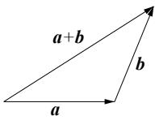
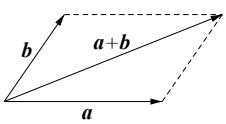
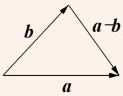

## 知识点 02 向量的线性运算和向量共线定理

## (1) 向量的线性运算

<table><tr><td>运算</td><td>定义</td><td>法则(或几何意义)</td><td>运算律</td></tr><tr><td>加法</td><td>求两个向量和的运算</td><td> 三角形法则平行四边形法则</td><td>1交换律 $a + b = b + a$ 2结合律 $(a + b) + c = a + (b + c)$ </td></tr><tr><td>减法</td><td>求 $a$ 与 $b$ 的相反向量- $b$ 的和的运算叫做 $a$ 与 $b$ 的差</td><td>三角形法则</td><td> $a - b = a + (-b)$ </td></tr><tr><td>数乘</td><td>求实数 $\lambda$ 与向量 $a$ 的积的运算</td><td>(1)  $|\lambda a| = |\lambda||a|$ (2)当 $\lambda >0$ 时, $\lambda a$ 与 $a$ 的方向相同;当λ&lt;0时,λa与a的方向相同;当λ=0时,λa=0</td><td> $\lambda(\mu a) = (\lambda\mu)a$  $(\lambda + \mu)a = \lambda a + \mu a$  $\lambda(a + b) = \lambda a + \lambda b$ </td></tr></table>

【注意】

(1) 向量表达式中的零向量写成 $0$ ，而不能写成 $0$ 。

（2）两个向量共线要区别与两条直线共线，两个向量共线满足的条件是：两个向量所在直线平行或重合，而

在直线中，两条直线重合与平行是两种不同的关系。

（3）要注意三角形法则和平行四边形法则适用的条件，运用平行四边形法则时两个向量的起点必须重合，和

向量与差向量分别是平行四边形的两条对角线所对应的向量；运用三角形法则时两个向量必须首尾相接，否

则就要把向量进行平移，使之符合条件。

(4) 向量加法和减法几何运算应该更广泛、灵活如： $OA - OB = BA$ ， $AM - AN = NM$ ， $OA = OB + CA \Leftrightarrow OA - OB = CA \Leftrightarrow BA - CA = BA + AC = BC$
