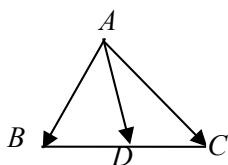

## 知识点 03 平面向量基本定理和性质

## 1. 共线向量基本定理

如果 $a = \lambda b(\lambda \in R)$ ，则 $a / / b$ ；反之，如果 $a / / b$ 且 $b\neq 0$ ，则一定存在唯一的实数 $\lambda$ ，使 $a = \lambda b$ （口诀：

数乘即得平行，平行必有数乘）.

## 2. 平面向量基本定理

如果 $e_1$ 和 $e_2$ 是同一个平面内的两个不共线向量，那么对于该平面内的任一向量 $a$ ，都存在唯一的一对实数

$\lambda_1, \lambda_2$ ，使得 $a = \lambda_1 e_1 + \lambda_2 e_2$ ，我们把不共线向量 $e_1, e_2$ 叫做表示这一平面内所有向量的一组基底，记为

$\left\{e_1, e_2\right\}$ ， $\lambda_1 e_1 + \lambda_2 e_2$ 叫做向量 $a$ 关于基底 $\left\{e_1, e_2\right\}$ 的分解式。

注意：由平面向量基本定理可知：只要向量 $e_1$ 与 $e_2$ 不共线，平面内的任一向量 $a$ 都可以分解成形如

$a = \lambda_{1}e_{1} + \lambda_{2}e_{2}$ 的形式，并且这样的分解是唯一的。 $\lambda_1e_1 + \lambda_2e_2$ 叫做 $e_1, e_2$ 的一个线性组合。平面向量基本定

理又叫平面向量分解定理，是平面向量正交分解的理论依据，也是向量的坐标表示的基础。

推论1：若 $a = \lambda_1\bar{e}_1 + \lambda_2\bar{e}_2 = \lambda_3\bar{e}_1 + \lambda_4\bar{e}_2$ ，则 $\lambda_{1} = \lambda_{3},\lambda_{2} = \lambda_{4}$ .推论2：若 $a = \lambda_1\bar{e}_1 + \lambda_2\bar{e}_2 = 0$ ，则 $\lambda_1 = \lambda_2 = 0$

## 3. 线段定比分点的向量表达式

如图所示，在 $\triangle ABC$ 中，若点 $D$ 是边 $BC$ 上的点，且 $\overrightarrow{BD} = \lambda \overrightarrow{DC}$ （ $\lambda \neq -1$ ），则向量 $\overrightarrow{AD} = \frac{\overrightarrow{AB} + \overrightarrow{\lambda AC}}{1 + \lambda}$ 。在向

量线性表示（运算）有关的问题中，若能熟练利用此结论，往往能有“化腐朽为神奇”之功效，建议熟练掌握。

## 4.三点共线定理

平面内三点 $A, B, C$ 共线的充要条件是：存在实数 $\lambda, \mu$ ，使 $OC = \lambda OA + \mu OB$ ，其中 $\lambda + \mu = 1$ ， $O$ 为平面内

一点．此定理在向量问题中经常用到，应熟练掌握．

## A、B、C三点共线

$\Leftrightarrow$ 存在唯一的实数 $\lambda$ ，使得 $AC = \lambda AB$ ； $\Leftrightarrow$ 存在唯一的实数 $\lambda$ ，使得 $OC = OA + \lambda AB$ ；

$\Leftrightarrow$ 存在唯一的实数 $\lambda$ ，使得 $OC = (1 - \lambda)OA + \lambda OB$ ； $\Leftrightarrow$ 存在 $\lambda +\mu = 1$ ，使得 $OC = \lambda OA + \mu OB$

## 5. 中线向量定理

如图所示，在 $\triangle ABC$ 中，若点 $D$ 是边 $BC$ 的中点，则中线向量 $AD = \frac{1}{2} (AB + AC)$ ，反之亦正确。

