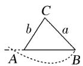

## 知识点 11 解三角形实际应用

## (1) 仰角和俯角

在视线和水平线所成的角中，视线在水平线上方的角叫仰角，在水平线下方的角叫俯角(如图①).

## (2) 方位角

从指北方向顺时针转到目标方向线的水平角，如 $B$ 点的方位角为 $\alpha$ (如图②).

(3) 方向角：相对于某一正方向的水平角。

(1)北偏东 $\alpha$ ，即由指北方向顺时针旋转 $\alpha$ 到达目标方向(如图③).

(2)北偏西 $\alpha$ ，即由指北方向逆时针旋转 $\alpha$ 到达目标方向.

(3)南偏西等其他方向角类似.

(4) 坡角与坡度

(1)坡角：坡面与水平面所成的二面角的度数(如图④，角θ为坡角).

(2)坡度：坡面的铅直高度与水平长度之比(如图④，i为坡度). 坡度又称为坡比.

## 方法技巧与总结

1. 方法技巧：解三角形多解情况

在 $\triangle ABC$ 中，已知 $a, b$ 和 $A$ 时，解的情况如下：

<table><tr><td></td><td colspan="3">A为锐角</td><td colspan="2">A为钝角或直角</td></tr><tr><td>图形</td><td></td><td></td><td></td><td colspan="2"></td></tr><tr><td>关系式</td><td>a=bsin A</td><td>bsin Aa ba&gt;ba≤b</td><td>a b</td><td>a&gt;b</td><td>a≤b</td></tr><tr><td>解的个数</td><td>一解</td><td>两解</td><td>一解</td><td>一解</td><td>无解</td></tr></table>

2. 在解三角形题目中，若已知条件同时含有边和角，但不能直接使用正弦定理或余弦定理得到答案，要选择

“边化角”或“角化边”，变换原则常用：

(1) 若式子含有 $\sin x$ 的齐次式，优先考虑正弦定理，“角化边”；

(2) 若式子含有 $a, b, c$ 的齐次式，优先考虑正弦定理，“边化角”；

(3) 若式子含有 $\cos x$ 的齐次式，优先考虑余弦定理，“角化边”；

(4) 代数变形或者三角恒等变换前置；

(5) 含有面积公式的问题，要考虑结合余弦定理使用；

(6) 同时出现两个自由角（或三个自由角）时，要用到 $A + B + C = \pi$ .
